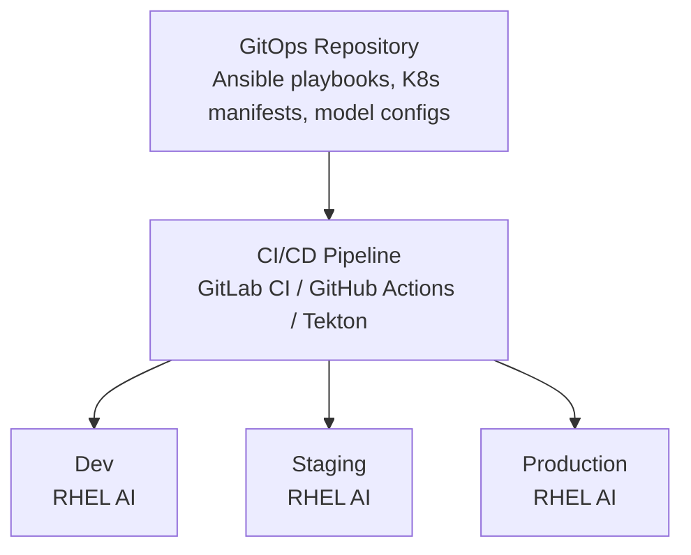

## Automating RHEL AI Deployments with Ansible and GitOps

Manual AI infrastructure deployment is error-prone, time-consuming, and impossible to audit effectively. As AI workloads scale across development, staging, and production environments, automation becomes essential. This guide, based on *Practical RHEL AI*, demonstrates how to implement Infrastructure as Code (IaC) for AI systems using Ansible and GitOps principles.

### Why Automate AI Deployments?

| Challenge | Manual Approach | Automated Approach |
|-----------|----------------|-------------------|
| Consistency | Configuration drift | Identical environments |
| Speed | Hours per deployment | Minutes per deployment |
| Auditability | Tribal knowledge | Git commit history |
| Rollback | Manual recovery | One-click revert |
| Scale | Limited by humans | Unlimited parallelism |

### Architecture Overview



### Prerequisites

- Ansible 2.15+ installed on control node
- Git repository for IaC code
- SSH access to target RHEL AI nodes
- (Optional) Kubernetes/OpenShift for container orchestration

### Step 1: Ansible Project Structure

Create a well-organized Ansible project:

```bash
mkdir -p rhel-ai-automation/{inventory,roles,playbooks,group_vars,files}
cd rhel-ai-automation

# Initialize git repository
git init
```

**Directory Structure:**

```
rhel-ai-automation/
├── ansible.cfg
├── inventory/
│   ├── production/
│   │   └── hosts.yml
│   └── staging/
│       └── hosts.yml
├── group_vars/
│   ├── all.yml
│   ├── gpu_nodes.yml
│   └── inference_nodes.yml
├── roles/
│   ├── rhel_ai_base/
│   ├── gpu_drivers/
│   ├── instructlab/
│   ├── vllm/
│   └── monitoring/
├── playbooks/
│   ├── site.yml
│   ├── deploy_inference.yml
│   └── update_model.yml
└── files/
    └── models/
```

### Step 2: Inventory Configuration

**Production Inventory (inventory/production/hosts.yml):**

```yaml
all:
  children:
    gpu_nodes:
      hosts:
        gpu-node-1:
          ansible_host: 192.168.1.101
          gpu_count: 4
          gpu_type: nvidia_a100
        gpu-node-2:
          ansible_host: 192.168.1.102
          gpu_count: 4
          gpu_type: nvidia_a100
    
    inference_nodes:
      hosts:
        inference-1:
          ansible_host: 192.168.1.111
          vllm_port: 8000
          tensor_parallel: 2
        inference-2:
          ansible_host: 192.168.1.112
          vllm_port: 8000
          tensor_parallel: 2
    
    training_nodes:
      hosts:
        train-1:
          ansible_host: 192.168.1.121
          deepspeed_enabled: true
    
    monitoring:
      hosts:
        monitor-1:
          ansible_host: 192.168.1.131
```

**Group Variables (group_vars/all.yml):**

```yaml
---
# RHEL AI Global Configuration
rhel_ai_version: "1.2"
model_registry: "registry.internal.com/ai-models"

# Default model configuration
default_model: "granite-7b-lab"
model_storage_path: "/var/lib/rhel-ai/models"

# Security settings
selinux_mode: enforcing
firewall_enabled: true

# Monitoring
prometheus_port: 9090
grafana_port: 3000

# Ansible settings
ansible_user: rhel-ai-admin
ansible_become: true
ansible_python_interpreter: /usr/bin/python3
```

### Step 3: Ansible Roles

**Role: RHEL AI Base (roles/rhel_ai_base/)**

```yaml
# roles/rhel_ai_base/tasks/main.yml
---
- name: Update system packages
  ansible.builtin.dnf:
    name: "*"
    state: latest
  tags: [base, update]

- name: Install required packages
  ansible.builtin.dnf:
    name:
      - git
      - curl
      - wget
      - podman
      - python3-pip
      - vim
      - tmux
    state: present
  tags: [base, packages]

- name: Enable RHEL AI repository
  ansible.builtin.command: >
    subscription-manager repos --enable rhel-9-for-x86_64-appstream-rpms
  changed_when: false
  tags: [base, repos]

- name: Install RHEL AI
  ansible.builtin.dnf:
    name: rhel-ai
    state: present
  tags: [base, rhel-ai]

- name: Create model storage directory
  ansible.builtin.file:
    path: "{{ model_storage_path }}"
    state: directory
    mode: '0755'
    owner: root
    group: root
    setype: container_file_t
  tags: [base, storage]

- name: Configure SELinux for AI workloads
  ansible.posix.selinux:
    policy: targeted
    state: "{{ selinux_mode }}"
  tags: [base, security]
```

**Role: GPU Drivers (roles/gpu_drivers/)**

```yaml
# roles/gpu_drivers/tasks/main.yml
---
- name: Add NVIDIA CUDA repository
  ansible.builtin.yum_repository:
    name: cuda-rhel9
    description: NVIDIA CUDA Repository for RHEL 9
    baseurl: https://developer.download.nvidia.com/compute/cuda/repos/rhel9/x86_64/
    gpgcheck: yes
    gpgkey: https://developer.download.nvidia.com/compute/cuda/repos/rhel9/x86_64/D42D0685.pub
    enabled: yes
  tags: [gpu, nvidia]

- name: Install NVIDIA drivers
  ansible.builtin.dnf:
    name:
      - nvidia-driver
      - cuda-toolkit-12-2
      - nvidia-container-toolkit
    state: present
  notify: Reboot for GPU drivers
  tags: [gpu, nvidia]

- name: Configure NVIDIA container runtime
  ansible.builtin.template:
    src: nvidia-container-runtime-config.toml.j2
    dest: /etc/nvidia-container-runtime/config.toml
    mode: '0644'
  tags: [gpu, container]

- name: Verify GPU detection
  ansible.builtin.command: nvidia-smi -L
  register: gpu_list
  changed_when: false
  tags: [gpu, verify]

- name: Display detected GPUs
  ansible.builtin.debug:
    msg: "{{ gpu_list.stdout_lines }}"
  tags: [gpu, verify]
```

**Role: vLLM Deployment (roles/vllm/)**

```yaml
# roles/vllm/tasks/main.yml
---
- name: Pull vLLM container image
  containers.podman.podman_image:
    name: "{{ vllm_image }}"
    state: present
  tags: [vllm, container]

- name: Download model if not present
  ansible.builtin.command: >
    ilab model download --model-name {{ model_name }} --repository {{ model_registry }}
  args:
    creates: "{{ model_storage_path }}/{{ model_name }}"
  tags: [vllm, model]

- name: Create vLLM systemd service
  ansible.builtin.template:
    src: vllm.service.j2
    dest: /etc/systemd/system/vllm-inference.service
    mode: '0644'
  notify: Restart vLLM service
  tags: [vllm, systemd]

- name: Enable and start vLLM service
  ansible.builtin.systemd:
    name: vllm-inference
    enabled: yes
    state: started
    daemon_reload: yes
  tags: [vllm, service]

- name: Wait for vLLM to be ready
  ansible.builtin.uri:
    url: "http://localhost:{{ vllm_port }}/health"
    status_code: 200
  register: result
  until: result.status == 200
  retries: 30
  delay: 10
  tags: [vllm, health]
```

**vLLM Service Template (roles/vllm/templates/vllm.service.j2):**

```ini
[Unit]
Description=vLLM Inference Server
After=network.target

[Service]
Type=simple
User=root
ExecStart=/usr/bin/podman run --rm \
    --name vllm-server \
    --device nvidia.com/gpu=all \
    -v {{ model_storage_path }}:/models:ro,Z \
    -p {{ vllm_port }}:8000 \
    {{ vllm_image }} \
    --model /models/{{ model_name }} \
    --host 0.0.0.0 \
    --port 8000 \
    --tensor-parallel-size {{ tensor_parallel | default(1) }} \
    --max-model-len {{ max_model_len | default(4096) }}
ExecStop=/usr/bin/podman stop vllm-server
Restart=always
RestartSec=10

[Install]
WantedBy=multi-user.target
```

### Step 4: Deployment Playbooks

**Main Site Playbook (playbooks/site.yml):**

```yaml
---
- name: Deploy RHEL AI Infrastructure
  hosts: all
  become: true
  
  pre_tasks:
    - name: Verify connectivity
      ansible.builtin.ping:
  
  roles:
    - role: rhel_ai_base
      tags: [base]

- name: Configure GPU Nodes
  hosts: gpu_nodes
  become: true
  
  roles:
    - role: gpu_drivers
      tags: [gpu]

- name: Deploy Inference Services
  hosts: inference_nodes
  become: true
  
  roles:
    - role: vllm
      vars:
        vllm_image: "registry.redhat.io/rhel-ai/vllm-runtime:latest"
        model_name: "{{ default_model }}"
      tags: [inference]

- name: Deploy Monitoring Stack
  hosts: monitoring
  become: true
  
  roles:
    - role: monitoring
      tags: [monitoring]
```

**Model Update Playbook (playbooks/update_model.yml):**

```yaml
---
- name: Update AI Model with Zero Downtime
  hosts: inference_nodes
  become: true
  serial: 1  # Rolling update, one node at a time
  
  vars:
    new_model_name: "{{ model_name | default('granite-7b-lab-v2') }}"
  
  tasks:
    - name: Remove node from load balancer
      ansible.builtin.uri:
        url: "http://{{ lb_host }}/api/nodes/{{ inventory_hostname }}/disable"
        method: POST
      delegate_to: localhost
      tags: [lb]
    
    - name: Wait for active requests to complete
      ansible.builtin.pause:
        seconds: 30
      tags: [graceful]
    
    - name: Download new model
      ansible.builtin.command: >
        ilab model download --model-name {{ new_model_name }}
      tags: [model]
    
    - name: Update model symlink
      ansible.builtin.file:
        src: "{{ model_storage_path }}/{{ new_model_name }}"
        dest: "{{ model_storage_path }}/current"
        state: link
      tags: [model]
    
    - name: Restart vLLM service
      ansible.builtin.systemd:
        name: vllm-inference
        state: restarted
      tags: [service]
    
    - name: Wait for service to be healthy
      ansible.builtin.uri:
        url: "http://localhost:{{ vllm_port }}/health"
        status_code: 200
      register: health
      until: health.status == 200
      retries: 30
      delay: 10
      tags: [health]
    
    - name: Re-enable node in load balancer
      ansible.builtin.uri:
        url: "http://{{ lb_host }}/api/nodes/{{ inventory_hostname }}/enable"
        method: POST
      delegate_to: localhost
      tags: [lb]
```

### Step 5: GitOps with ArgoCD

**Application Manifest (argocd/rhel-ai-app.yaml):**

```yaml
apiVersion: argoproj.io/v1alpha1
kind: Application
metadata:
  name: rhel-ai-inference
  namespace: argocd
spec:
  project: default
  
  source:
    repoURL: https://gitlab.internal.com/ai-platform/rhel-ai-automation.git
    targetRevision: main
    path: kubernetes/inference
  
  destination:
    server: https://kubernetes.default.svc
    namespace: rhel-ai
  
  syncPolicy:
    automated:
      prune: true
      selfHeal: true
    syncOptions:
      - CreateNamespace=true
    retry:
      limit: 5
      backoff:
        duration: 5s
        factor: 2
        maxDuration: 3m
```

### Step 6: CI/CD Pipeline

**GitLab CI Pipeline (.gitlab-ci.yml):**

```yaml
stages:
  - lint
  - test
  - deploy-staging
  - deploy-production

variables:
  ANSIBLE_HOST_KEY_CHECKING: "false"

.ansible-base:
  image: registry.redhat.io/ansible-automation-platform/ee-supported-rhel9:latest
  before_script:
    - ansible-galaxy collection install -r requirements.yml

lint:
  extends: .ansible-base
  stage: lint
  script:
    - ansible-lint playbooks/
    - yamllint .

test:
  extends: .ansible-base
  stage: test
  script:
    - ansible-playbook playbooks/site.yml --syntax-check
    - molecule test
  only:
    - merge_requests

deploy-staging:
  extends: .ansible-base
  stage: deploy-staging
  script:
    - ansible-playbook -i inventory/staging playbooks/site.yml
  environment:
    name: staging
  only:
    - main

deploy-production:
  extends: .ansible-base
  stage: deploy-production
  script:
    - ansible-playbook -i inventory/production playbooks/site.yml
  environment:
    name: production
  when: manual
  only:
    - main
```

### Step 7: Ansible Vault for Secrets

```bash
# Create encrypted secrets file
ansible-vault create group_vars/vault.yml

# Add secrets
api_keys:
  model_registry_token: "secret-token-here"
  prometheus_password: "monitoring-password"

# Use in playbooks with vault reference
# ansible-playbook site.yml --ask-vault-pass
```

### Best Practices

1. **Idempotency**: Ensure all tasks can be run multiple times safely
2. **Tags**: Use tags for selective execution
3. **Handlers**: Use handlers for service restarts
4. **Variables**: Keep environment-specific configs in inventory
5. **Testing**: Use Molecule for role testing
6. **Documentation**: Maintain README files for each role

### Conclusion

Automating RHEL AI deployments with Ansible and GitOps transforms AI infrastructure management from a manual, error-prone process into a repeatable, auditable workflow. Combined with CI/CD pipelines, teams can achieve continuous deployment of AI models with confidence.

For advanced topics including multi-cloud deployments, disaster recovery automation, and MLOps pipelines, refer to Chapters 14-16 of *Practical RHEL AI*.

import Link from "../../components/ui/link.astro";

<Link size="lg" href="https://amzn.to/4qjORdC" class="flex gap-2 items-center justify-center bg-blue-600 text-white px-5 py-3 rounded-lg shadow-md hover:bg-blue-700">
  Get Practical RHEL AI on Amazon
</Link>
