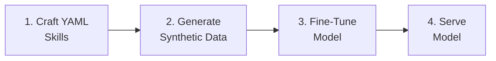

> **📘 Book Reference:** This article is based on **Chapter 3: Core Components** and **Chapter 5: Custom Applications** of [Practical RHEL AI](/books/), covering the InstructLab four-step workflow for building custom AI skills.

## Introduction

Generic AI models are useful, but enterprise value comes from **domain-specific capabilities**. InstructLab's taxonomy system lets you teach models new skills without massive training datasets—a core innovation covered extensively in *Practical RHEL AI*.

## The Four-Step InstructLab Workflow

As detailed in the book, InstructLab follows a structured approach:



## Step 1: Understanding Taxonomy Structure

### Directory Layout

```
taxonomy/
├── knowledge/
│   ├── technology/
│   │   ├── rhel/
│   │   │   └── qna.yaml
│   │   └── kubernetes/
│   │       └── qna.yaml
│   └── business/
│       └── finance/
│           └── qna.yaml
└── skills/
    ├── writing/
    │   └── technical-docs/
    │       └── qna.yaml
    └── coding/
        └── ansible/
            └── qna.yaml
```

### Knowledge vs Skills

| Type | Purpose | Example |
|------|---------|---------|
| **Knowledge** | Factual information | "RHEL 9 uses systemd for service management" |
| **Skills** | Capabilities/behaviors | "Write an Ansible playbook for..." |

## Step 2: Writing Skill Definitions

### Basic Skill YAML

```yaml
# taxonomy/skills/coding/ansible/qna.yaml
created_by: luca-berton
version: 3
task_description: >
  Teach the model to write Ansible playbooks following Red Hat best practices,
  including proper YAML syntax, idempotent tasks, and role structure.

seed_examples:
  - question: |
      Write an Ansible playbook to install and configure Nginx on RHEL 9.
    answer: |
      Here's an Ansible playbook following Red Hat best practices:

      ```yaml
      ---
      - name: Install and configure Nginx
        hosts: webservers
        become: true

        tasks:
          - name: Install Nginx package
            ansible.builtin.dnf:
              name: nginx
              state: present

          - name: Start and enable Nginx service
            ansible.builtin.systemd:
              name: nginx
              state: started
              enabled: true

          - name: Open firewall for HTTP
            ansible.posix.firewalld:
              service: http
              permanent: true
              state: enabled
              immediate: true
      ```

  - question: |
      Create an Ansible role structure for deploying a PostgreSQL database.
    answer: |
      Here's the recommended role structure:

      ```
      roles/postgresql/
      ├── defaults/
      │   └── main.yml      # Default variables
      ├── handlers/
      │   └── main.yml      # Service handlers
      ├── tasks/
      │   └── main.yml      # Main task list
      ├── templates/
      │   └── pg_hba.conf.j2  # Configuration templates
      └── vars/
          └── main.yml      # Role variables
      ```

      **defaults/main.yml:**
      ```yaml
      postgresql_version: "15"
      postgresql_data_dir: /var/lib/pgsql/data
      ```

      **tasks/main.yml:**
      ```yaml
      ---
      - name: Install PostgreSQL packages
        ansible.builtin.dnf:
          name:
            - postgresql-server
            - postgresql-contrib
          state: present

      - name: Initialize database
        ansible.builtin.command:
          cmd: postgresql-setup --initdb
          creates: "{{ postgresql_data_dir }}/PG_VERSION"
      ```

  - question: |
      Write a playbook that uses ansible-vault for sensitive data.
    answer: |
      Here's how to use Ansible Vault for secrets:

      **Create encrypted variables file:**
      ```bash
      ansible-vault create group_vars/all/vault.yml
      ```

      **vault.yml content:**
      ```yaml
      vault_db_password: "supersecretpassword"
      vault_api_key: "abc123xyz789"
      ```

      **Playbook using vault variables:**
      ```yaml
      ---
      - name: Deploy application with secrets
        hosts: app_servers
        become: true
        vars_files:
          - group_vars/all/vault.yml

        tasks:
          - name: Configure database connection
            ansible.builtin.template:
              src: db_config.j2
              dest: /etc/app/database.conf
              mode: '0600'
            vars:
              db_password: "{{ vault_db_password }}"
      ```

      **Run with vault:**
      ```bash
      ansible-playbook site.yml --ask-vault-pass
      ```
```

### Knowledge YAML Example

```yaml
# taxonomy/knowledge/technology/rhel-ai/qna.yaml
created_by: luca-berton
version: 3
task_description: >
  Provide accurate information about RHEL AI components, capabilities,
  and deployment patterns.

document_outline: |
  RHEL AI is Red Hat's enterprise AI platform built on RHEL 9+.
  Key components include InstructLab, vLLM, and DeepSpeed.

seed_examples:
  - context: |
      RHEL AI includes vLLM for high-performance inference serving.
      vLLM uses PagedAttention for efficient memory management.
    question: What inference engine does RHEL AI use?
    answer: |
      RHEL AI uses vLLM as its primary inference engine. vLLM features:
      - PagedAttention algorithm for efficient KV cache management
      - Continuous batching for high throughput
      - OpenAI-compatible API for easy integration
      - Support for tensor parallelism across multiple GPUs

  - context: |
      The InstructLab workflow consists of four steps: craft YAML skills,
      generate synthetic data, fine-tune the model, and serve the model.
    question: How do you fine-tune models in RHEL AI?
    answer: |
      RHEL AI uses InstructLab for model fine-tuning with a four-step workflow:
      
      1. **Craft YAML skills**: Define capabilities in taxonomy format
      2. **Generate synthetic data**: Automatically create training examples
      3. **Fine-tune**: Train Granite or Mixtral models with DeepSpeed
      4. **Serve**: Deploy via vLLM with OpenAI-compatible API
      
      This approach requires minimal seed examples (3-5) to teach new skills.
```

## Step 3: Generating Synthetic Data

### Running Data Generation

```bash
# Initialize InstructLab
ilab config init

# Download base model for generation
ilab model download --model-name granite-7b-lab

# Generate synthetic training data
ilab data generate \
  --num-instructions 1000 \
  --taxonomy-path ./taxonomy \
  --output-dir ./generated-data

# Review generated samples
head -20 ./generated-data/train_gen.jsonl
```

### Generation Output

```json
{
  "instruction": "Write an Ansible playbook to configure SSH hardening on RHEL servers.",
  "input": "",
  "output": "Here's an Ansible playbook for SSH hardening:\n\n```yaml\n---\n- name: Harden SSH configuration\n  hosts: all\n  become: true\n\n  tasks:\n    - name: Configure SSH daemon\n      ansible.builtin.lineinfile:\n        path: /etc/ssh/sshd_config\n        regexp: \"{{ item.regexp }}\"\n        line: \"{{ item.line }}\"\n      loop:\n        - { regexp: '^#?PermitRootLogin', line: 'PermitRootLogin no' }\n        - { regexp: '^#?PasswordAuthentication', line: 'PasswordAuthentication no' }\n        - { regexp: '^#?X11Forwarding', line: 'X11Forwarding no' }\n      notify: Restart sshd\n\n  handlers:\n    - name: Restart sshd\n      ansible.builtin.systemd:\n        name: sshd\n        state: restarted\n```"
}
```

### Quality Control

```python
# validate_generated_data.py
import json

def validate_sample(sample):
    """Check generated data quality."""
    checks = {
        "has_instruction": len(sample.get("instruction", "")) > 20,
        "has_output": len(sample.get("output", "")) > 50,
        "code_blocks_valid": "```" in sample.get("output", "") 
                            if "playbook" in sample.get("instruction", "").lower() 
                            else True,
        "no_truncation": not sample.get("output", "").endswith("..."),
    }
    return all(checks.values()), checks

# Validate all samples
with open("generated-data/train_gen.jsonl") as f:
    samples = [json.loads(line) for line in f]

valid_count = sum(1 for s in samples if validate_sample(s)[0])
print(f"Valid samples: {valid_count}/{len(samples)} ({valid_count/len(samples)*100:.1f}%)")
```

## Step 4: Fine-Tuning the Model

### Training Configuration

```yaml
# training-config.yaml
model:
  name: granite-7b-lab
  path: ./models/granite-7b-lab

training:
  epochs: 3
  batch_size: 4
  learning_rate: 1e-5
  warmup_steps: 100
  gradient_accumulation_steps: 4

deepspeed:
  zero_stage: 2
  offload_optimizer: false

data:
  train_file: ./generated-data/train_gen.jsonl
  validation_split: 0.1

output:
  dir: ./fine-tuned-model
  save_steps: 500
```

### Running Training

```bash
# Start fine-tuning
ilab model train \
  --config training-config.yaml \
  --gpus 2

# Monitor training progress
tail -f ./fine-tuned-model/training.log

# Training output:
# Epoch 1/3: loss=2.34, lr=5e-6
# Epoch 2/3: loss=1.87, lr=1e-5
# Epoch 3/3: loss=1.42, lr=5e-6
# Training complete. Model saved to ./fine-tuned-model
```

## Step 5: Validating the Fine-Tuned Model

### MMLU Evaluation

```bash
# Run MMLU benchmark
ilab model evaluate \
  --model ./fine-tuned-model \
  --benchmark mmlu \
  --output results.json

# Compare to baseline
ilab model evaluate \
  --model granite-7b-lab \
  --benchmark mmlu \
  --output baseline.json
```

### Custom Skill Validation

```python
# validate_skills.py
from vllm import LLM, SamplingParams

# Load fine-tuned model
llm = LLM(model="./fine-tuned-model")
sampling = SamplingParams(temperature=0.1, max_tokens=1024)

# Test cases for Ansible skills
test_cases = [
    "Write a playbook to install Docker on RHEL 9",
    "Create an Ansible role for MySQL deployment",
    "How do you use handlers in Ansible?",
]

print("=== Skill Validation Results ===\n")
for prompt in test_cases:
    response = llm.generate([prompt], sampling)[0]
    print(f"Q: {prompt}")
    print(f"A: {response.outputs[0].text[:500]}...")
    print("-" * 50)
```

### Validation Checklist

| Check | Criteria | Pass/Fail |
|-------|----------|-----------|
| MMLU Score | ≥ baseline - 1% | ✅ |
| Skill Accuracy | 90%+ correct format | ✅ |
| No Hallucinations | Verified facts | ✅ |
| Response Quality | Coherent, helpful | ✅ |
| Latency | Within SLO | ✅ |

## Deploying the Custom Model

```bash
# Serve fine-tuned model
ilab model serve \
  --model ./fine-tuned-model \
  --port 8000

# Test endpoint
curl http://localhost:8000/v1/chat/completions \
  -H "Content-Type: application/json" \
  -d '{
    "model": "fine-tuned-model",
    "messages": [
      {"role": "user", "content": "Write an Ansible playbook for NTP configuration"}
    ]
  }'
```

## Related Book Content

This article covers material from:
- **Chapter 3: Core Components** - InstructLab workflow
- **Chapter 5: Custom Applications** - Taxonomy development
- **Chapter 6: Monitoring** - Model validation and MMLU drift

---

## Build Enterprise AI Skills

**Want to create custom AI capabilities for your organization?**

*Practical RHEL AI* provides the complete guide to InstructLab:

- ✅ 50+ taxonomy examples across industries
- ✅ Advanced skill composition patterns
- ✅ Quality assurance frameworks
- ✅ Enterprise taxonomy governance
- ✅ Multi-model skill transfer techniques

<div style="background: linear-gradient(135deg, #ee0000 0%, #cc0000 100%); padding: 2rem; border-radius: 12px; text-align: center; margin: 2rem 0;">
  <h3 style="color: white; margin-bottom: 1rem;">🧠 Teach AI Your Domain Expertise</h3>
  <p style="color: white; margin-bottom: 1.5rem;"><strong>Practical RHEL AI</strong> shows you how to build custom AI skills that understand your business—without massive training datasets.</p>
  <a href="/books/" style="display: inline-block; background: white; color: #cc0000; padding: 0.75rem 2rem; border-radius: 8px; font-weight: bold; text-decoration: none; margin-right: 1rem;">Learn More →</a>
  <a href="https://amzn.to/4qjORdC" style="display: inline-block; background: #ff9900; color: #111; padding: 0.75rem 2rem; border-radius: 8px; font-weight: bold; text-decoration: none;">Buy on Amazon →</a>
</div>
