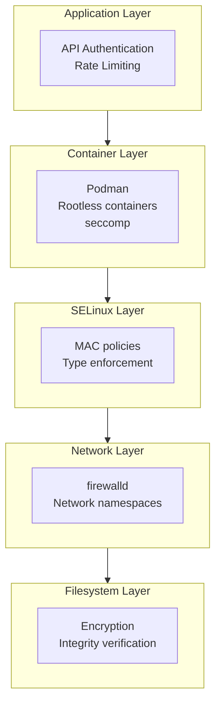

## Enterprise AI Security: Hardening RHEL AI with SELinux and Container Isolation

AI systems process sensitive data, make critical decisions, and increasingly become targets for adversarial attacks. Unlike traditional applications, AI workloads introduce unique security challenges: model theft, training data poisoning, prompt injection, and inference manipulation. This guide, based on *Practical RHEL AI*, demonstrates how to build a defense-in-depth security posture for enterprise AI deployments.

### The AI Security Threat Landscape

Before implementing controls, understand the threats specific to AI systems:

| Threat Category | Attack Vector | Impact |
|-----------------|---------------|--------|
| Model Theft | Unauthorized access to model weights | IP loss, competitive disadvantage |
| Data Poisoning | Injecting malicious training data | Compromised model behavior |
| Prompt Injection | Manipulating model inputs | Data exfiltration, unauthorized actions |
| Inference Attacks | Model inversion, membership inference | Privacy violations |
| Supply Chain | Compromised dependencies, base images | Full system compromise |

### Security Architecture Overview

RHEL AI provides multiple security layers:



### Step 1: SELinux Configuration for AI Workloads

SELinux provides mandatory access control (MAC) that confines processes to the minimum required privileges.

**Verify SELinux is Enforcing:**

```bash
# Check SELinux status
getenforce
# Should return: Enforcing

# View SELinux configuration
cat /etc/selinux/config
```

**Create Custom Policy for InstructLab:**

```bash
# Generate a policy module for InstructLab
cat > instructlab.te << 'EOF'
module instructlab 1.0;

require {
    type container_t;
    type nvidia_device_t;
    type hugetlbfs_t;
    class chr_file { read write open ioctl };
    class file { read write execute execute_no_trans };
}

# Allow containers to access NVIDIA devices
allow container_t nvidia_device_t:chr_file { read write open ioctl };

# Allow access to huge pages for GPU memory
allow container_t hugetlbfs_t:file { read write };
EOF

# Compile and install the module
checkmodule -M -m -o instructlab.mod instructlab.te
semodule_package -o instructlab.pp -m instructlab.mod
semodule -i instructlab.pp
```

**Configure File Contexts for Models:**

```bash
# Create directory for AI models with proper SELinux context
mkdir -p /var/lib/rhel-ai/models

# Set SELinux context for model storage
semanage fcontext -a -t container_file_t "/var/lib/rhel-ai/models(/.*)?"
restorecon -Rv /var/lib/rhel-ai/models

# Verify the context
ls -laZ /var/lib/rhel-ai/models
```

### Step 2: Rootless Container Security with Podman

Rootless containers eliminate an entire class of privilege escalation attacks.

**Configure Rootless Podman:**

```bash
# Create dedicated AI service user
useradd -r -s /sbin/nologin rhel-ai-svc
loginctl enable-linger rhel-ai-svc

# Configure subuid/subgid ranges
echo "rhel-ai-svc:100000:65536" >> /etc/subuid
echo "rhel-ai-svc:100000:65536" >> /etc/subgid

# Set up user namespace
podman system migrate
```

**Run Inference Container Rootlessly:**

```bash
# Switch to service user
sudo -u rhel-ai-svc bash

# Run vLLM with minimal privileges
podman run --rm \
    --user 1000:1000 \
    --security-opt no-new-privileges:true \
    --security-opt seccomp=/etc/containers/seccomp.json \
    --cap-drop ALL \
    --read-only \
    --tmpfs /tmp:rw,noexec,nosuid \
    -v /var/lib/rhel-ai/models:/models:ro,Z \
    -p 8000:8000 \
    registry.redhat.io/rhel-ai/vllm-runtime:latest \
    --model /models/granite-7b
```

**Create Seccomp Profile for AI Workloads:**

```json
{
  "defaultAction": "SCMP_ACT_ERRNO",
  "architectures": ["SCMP_ARCH_X86_64"],
  "syscalls": [
    {
      "names": [
        "read", "write", "open", "close", "stat", "fstat",
        "mmap", "mprotect", "munmap", "brk", "ioctl",
        "access", "pipe", "select", "sched_yield",
        "clone", "fork", "execve", "exit", "wait4",
        "futex", "set_tid_address", "set_robust_list",
        "arch_prctl", "pread64", "openat", "newfstatat",
        "getrandom", "memfd_create"
      ],
      "action": "SCMP_ACT_ALLOW"
    }
  ]
}
```

### Step 3: Network Security and Segmentation

**Configure Firewall Rules:**

```bash
# Create AI inference zone
firewall-cmd --permanent --new-zone=ai-inference

# Allow only necessary ports
firewall-cmd --permanent --zone=ai-inference --add-port=8000/tcp
firewall-cmd --permanent --zone=ai-inference --add-port=9090/tcp  # Prometheus

# Restrict source IPs to internal networks
firewall-cmd --permanent --zone=ai-inference --add-source=10.0.0.0/8

# Apply changes
firewall-cmd --reload
```

**Network Namespace Isolation:**

```bash
# Create isolated network for AI pods
podman network create \
    --driver bridge \
    --subnet 172.20.0.0/24 \
    --gateway 172.20.0.1 \
    ai-internal

# Run inference pod in isolated network
podman run --network ai-internal \
    -p 127.0.0.1:8000:8000 \
    registry.redhat.io/rhel-ai/vllm-runtime:latest
```

### Step 4: Secrets and Credential Management

**Use Podman Secrets for API Keys:**

```bash
# Create secret for model registry credentials
echo "your-api-key" | podman secret create hf-token -

# Use secret in container
podman run --secret hf-token \
    -e HF_TOKEN_FILE=/run/secrets/hf-token \
    registry.redhat.io/rhel-ai/instructlab:latest
```

**Integrate with HashiCorp Vault:**

```bash
# Install Vault agent
dnf install -y vault

# Configure Vault agent for AI workloads
cat > /etc/vault/agent.hcl << 'EOF'
auto_auth {
  method {
    type = "approle"
    config = {
      role_id_file_path = "/etc/vault/role-id"
      secret_id_file_path = "/etc/vault/secret-id"
    }
  }
}

template {
  source = "/etc/vault/templates/ai-secrets.ctmpl"
  destination = "/run/secrets/ai-config"
}
EOF
```

### Step 5: Model Integrity and Supply Chain Security

**Verify Model Signatures:**

```bash
# Download model with checksum verification
ilab model download \
    --model-name granite-7b-lab \
    --verify-checksum

# Create GPG signature for fine-tuned models
gpg --armor --detach-sign ./fine-tuned-model/config.json
```

**Container Image Signing with Sigstore:**

```bash
# Sign container image
cosign sign --key cosign.key \
    registry.internal.com/rhel-ai/inference:v1.0

# Verify before deployment
cosign verify --key cosign.pub \
    registry.internal.com/rhel-ai/inference:v1.0
```

**Configure Image Trust Policy:**

```json
{
  "default": [{"type": "reject"}],
  "transports": {
    "docker": {
      "registry.redhat.io": [{"type": "signedBy", "keyType": "GPGKeys", "keyPath": "/etc/pki/rpm-gpg/RPM-GPG-KEY-redhat-release"}],
      "registry.internal.com": [{"type": "signedBy", "keyType": "GPGKeys", "keyPath": "/etc/pki/containers/internal-key.gpg"}]
    }
  }
}
```

### Step 6: Audit and Compliance

**Enable Comprehensive Auditing:**

```bash
# Configure auditd for AI workload monitoring
cat >> /etc/audit/rules.d/ai-workloads.rules << 'EOF'
# Monitor model file access
-w /var/lib/rhel-ai/models -p rwxa -k ai_model_access

# Monitor inference service configuration
-w /etc/rhel-ai -p wa -k ai_config_change

# Monitor container runtime
-w /usr/bin/podman -p x -k container_exec

# Monitor GPU device access
-w /dev/nvidia0 -p rw -k gpu_access
EOF

# Reload audit rules
augenrules --load
```

**Generate Compliance Reports:**

```bash
# Install OpenSCAP
dnf install -y openscap-scanner scap-security-guide

# Run STIG compliance scan
oscap xccdf eval \
    --profile xccdf_org.ssgproject.content_profile_stig \
    --results scan-results.xml \
    --report compliance-report.html \
    /usr/share/xml/scap/ssg/content/ssg-rhel9-ds.xml
```

### Step 7: Runtime Protection

**Configure Falco for AI Workload Monitoring:**

```yaml
# /etc/falco/rules.d/ai-workloads.yaml
- rule: Unauthorized Model Access
  desc: Detect unauthorized access to AI model files
  condition: >
    open_read and 
    fd.name startswith /var/lib/rhel-ai/models and
    not proc.name in (vllm, ilab, python)
  output: >
    Unauthorized model access (user=%user.name command=%proc.cmdline file=%fd.name)
  priority: WARNING

- rule: Suspicious Inference Request
  desc: Detect potential prompt injection attempts
  condition: >
    evt.type = write and 
    fd.name = /var/log/inference/requests.log and
    evt.arg.data contains "ignore previous"
  output: >
    Potential prompt injection detected (data=%evt.arg.data)
  priority: CRITICAL
```

### Security Checklist

Before deploying AI workloads to production, verify:

- [ ] SELinux is in enforcing mode
- [ ] Containers run rootless with dropped capabilities
- [ ] Network segmentation isolates AI services
- [ ] Model files have proper SELinux contexts
- [ ] Container images are signed and verified
- [ ] Secrets are managed externally (Vault, Kubernetes secrets)
- [ ] Audit logging captures all AI-related events
- [ ] Compliance scans pass organizational requirements
- [ ] Incident response procedures include AI-specific scenarios

### Conclusion

Security for AI workloads requires a comprehensive approach that addresses traditional infrastructure concerns while accounting for AI-specific threats. RHEL AI's integration with SELinux, Podman's rootless containers, and enterprise security tooling provides a solid foundation for building secure AI systems.

For advanced security topics including adversarial ML defense, federated learning security, and AI-specific incident response, refer to Chapters 13-15 of *Practical RHEL AI*.

import Link from "../../components/ui/link.astro";

<Link size="lg" href="https://amzn.to/4qjORdC" class="flex gap-2 items-center justify-center bg-blue-600 text-white px-5 py-3 rounded-lg shadow-md hover:bg-blue-700">
  Get Practical RHEL AI on Amazon
</Link>
