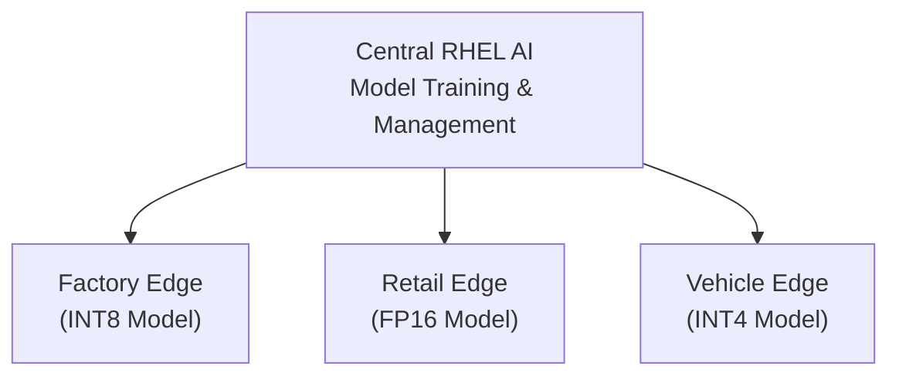
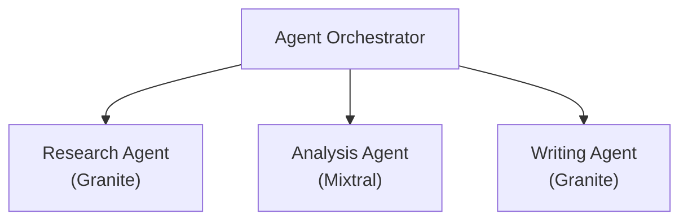

> **📘 Book Reference:** This article is based on **Chapter 8: Future Trends** of [Practical RHEL AI](/books/), exploring the cutting-edge developments shaping enterprise AI on Red Hat Enterprise Linux.

## Introduction

The enterprise AI landscape is evolving rapidly. Chapter 8 of *Practical RHEL AI* examines emerging trends that will shape how organizations deploy and manage AI workloads on RHEL. From edge computing to responsible AI, these developments are already influencing the platform's roadmap.

## Trend 1: Edge AI Deployment

### The Edge Imperative

Enterprise AI is moving closer to data sources. RHEL AI supports edge deployments with:
- **Quantized models** for resource-constrained environments
- **Offline-capable** inference
- **Federated learning** patterns

### Architecture Pattern



### Implementation Preview

```python
# Edge deployment configuration
edge_config = {
    "deployment_type": "edge",
    "model_format": "onnx_int8",
    "hardware_constraints": {
        "max_memory_gb": 8,
        "gpu": "optional",
        "cpu_cores": 4
    },
    "sync_policy": {
        "model_updates": "weekly",
        "telemetry_upload": "daily",
        "offline_capable": True
    }
}
```

## Trend 2: Explainable AI (XAI)

### Why Explainability Matters

Regulatory requirements and enterprise governance demand AI systems that can explain their decisions:

- **EU AI Act** compliance
- **Internal audit** requirements
- **Customer trust** building

### RHEL AI XAI Features

```python
from rhel_ai.explain import ExplainableLLM

# Initialize explainable model
model = ExplainableLLM(
    base_model="granite-3b-instruct",
    explain_method="attention_attribution"
)

# Get prediction with explanation
result = model.predict_with_explanation(
    prompt="Classify this loan application...",
    explain_depth="detailed"
)

print(result.prediction)
print(result.explanation)
print(result.confidence_factors)
```

### Explanation Output Format

```json
{
  "prediction": "APPROVED",
  "confidence": 0.92,
  "explanation": {
    "primary_factors": [
      {"factor": "income_stability", "weight": 0.35},
      {"factor": "credit_history", "weight": 0.30},
      {"factor": "debt_ratio", "weight": 0.25}
    ],
    "attention_highlights": [
      "10 years employment at current company",
      "No missed payments in 5 years"
    ]
  }
}
```

## Trend 3: Carbon-Aware Scheduling

### Sustainable AI Operations

Chapter 8 introduces **carbon-aware scheduling** for environmentally conscious AI deployments:

### How It Works

```yaml
# carbon-aware-scheduler.yaml
apiVersion: rhel.ai/v1
kind: CarbonAwareScheduler
metadata:
  name: sustainable-training
spec:
  carbonIntensityThreshold: 200  # gCO2/kWh
  preferredRegions:
    - "us-west-2"   # High renewable %
    - "eu-north-1"  # Nordic hydro
  scheduling:
    deferrable: true
    maxDelay: "4h"
    urgencyOverride: false
  monitoring:
    trackEmissions: true
    reportInterval: "1h"
```

### Integration with Grid Data

```python
from rhel_ai.carbon import CarbonAwareExecutor

executor = CarbonAwareExecutor(
    grid_api="https://api.electricitymap.org",
    max_carbon_intensity=250  # gCO2/kWh
)

# Schedule training during low-carbon periods
@executor.schedule_low_carbon
async def train_model(config):
    # Training runs when grid is cleaner
    return await run_training(config)
```

## Trend 4: Multi-Agent Orchestration

### Beyond Single Models

Future RHEL AI deployments will orchestrate multiple specialized agents:



### Implementation Pattern

```python
from rhel_ai.agents import AgentOrchestrator, Agent

# Define specialized agents
research_agent = Agent(
    name="researcher",
    model="granite-research-v1",
    capabilities=["search", "summarize", "cite"]
)

analysis_agent = Agent(
    name="analyst", 
    model="mixtral-analysis-v1",
    capabilities=["analyze", "compare", "recommend"]
)

# Orchestrate workflow
orchestrator = AgentOrchestrator(
    agents=[research_agent, analysis_agent],
    workflow="sequential"
)

result = await orchestrator.execute(
    task="Research and analyze market trends in renewable energy"
)
```

## Trend 5: LLMOps Maturity

### Production ML at Scale

The evolution of LLMOps practices on RHEL AI:

| Maturity Level | Characteristics | RHEL AI Features |
|---------------|-----------------|------------------|
| **Level 1** | Manual deployment | Basic vLLM serving |
| **Level 2** | CI/CD integration | Ansible playbooks |
| **Level 3** | Automated monitoring | MMLU drift, Prometheus |
| **Level 4** | Self-healing | Policy-as-code gates |
| **Level 5** | Autonomous optimization | Carbon-aware, auto-scaling |

### GitOps for Models

```yaml
# model-deployment.yaml (GitOps)
apiVersion: rhel.ai/v1
kind: ModelDeployment
metadata:
  name: production-granite
  annotations:
    rhel.ai/auto-promote: "true"
    rhel.ai/canary-percent: "10"
spec:
  model:
    name: granite-3b-instruct
    version: "2024.1.15"
    registry: registry.redhat.io/rhel-ai
  serving:
    replicas: 3
    resources:
      gpu: 1
      memory: 32Gi
  validation:
    mmluThreshold: 0.85
    latencyP95: "80ms"
```

## Trend 6: Federated Learning

### Privacy-Preserving Training

Train models across organizational boundaries without sharing raw data:

```python
from rhel_ai.federated import FederatedLearning

# Initialize federated coordinator
fl_coordinator = FederatedLearning(
    participants=["hospital_a", "hospital_b", "hospital_c"],
    aggregation_method="fedavg",
    privacy_budget=1.0  # Differential privacy
)

# Run federated training round
global_model = await fl_coordinator.train_round(
    local_epochs=3,
    batch_size=32
)
```

## Preparing for the Future

### Recommendations from Chapter 8

1. **Start with edge pilots** - Test quantized models in controlled environments
2. **Implement XAI early** - Build explainability into your AI governance
3. **Track carbon metrics** - Even before carbon-aware scheduling is mandatory
4. **Design for multi-agent** - Modular architectures enable future orchestration
5. **Adopt GitOps** - Version control everything, including model configurations

## Related Book Content

This article covers material from:
- **Chapter 8: Future Trends** - All emerging technologies
- **Chapter 4: Advanced Features** - Foundation for edge and optimization
- **Chapter 6: Monitoring** - LLMOps practices

---

## 📚 Future-Proof Your AI Strategy

**Want to stay ahead of the AI curve?**

*Practical RHEL AI* covers emerging technologies:

- ✅ Edge AI deployment architectures
- ✅ Explainable AI implementation guides
- ✅ Carbon-aware scheduling patterns
- ✅ Multi-agent orchestration frameworks
- ✅ LLMOps maturity roadmaps

<div style="background: linear-gradient(135deg, #ee0000 0%, #cc0000 100%); padding: 2rem; border-radius: 12px; text-align: center; margin: 2rem 0;">
  <h3 style="color: white; margin-bottom: 1rem;">🚀 Lead the AI Revolution</h3>
  <p style="color: white; margin-bottom: 1.5rem;"><strong>Practical RHEL AI</strong> prepares you for the next generation of enterprise AI technologies.</p>
  <a href="/books/" style="display: inline-block; background: white; color: #cc0000; padding: 0.75rem 2rem; border-radius: 8px; font-weight: bold; text-decoration: none; margin-right: 1rem;">Learn More →</a>
  <a href="https://amzn.to/4qjORdC" style="display: inline-block; background: #ff9900; color: #111; padding: 0.75rem 2rem; border-radius: 8px; font-weight: bold; text-decoration: none;">Buy on Amazon →</a>
</div>
