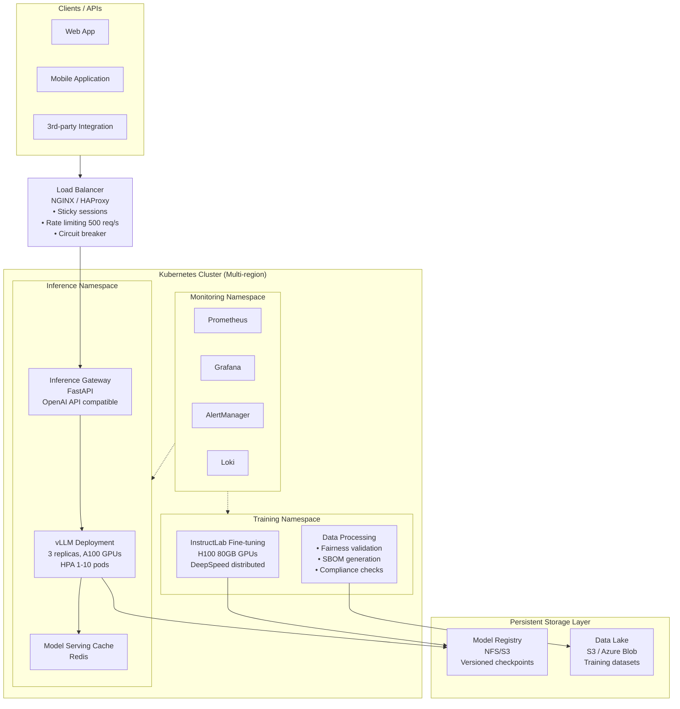

## Production-Ready RHEL AI: From Development to Enterprise Scale

The gap between a fine-tuned model and production deployment is where most AI projects stumble. Researchers celebrate 93% accuracy in notebooks while operations teams scramble to maintain it in production.

This final article covers battle-tested patterns for deploying RHEL AI at enterprise scale: infrastructure-as-code, CI/CD automation, Kubernetes orchestration, and multi-cloud strategies.

### Production Architecture

Here's a production-ready RHEL AI architecture:



### 1. Kubernetes Deployment with GPU Support

Deploy RHEL AI on Kubernetes with full GPU orchestration:

```yaml
# rhel-ai-deployment.yaml
apiVersion: apps/v1
kind: Deployment
metadata:
  name: vllm-granite-prod
  namespace: rhel-ai-inference
spec:
  replicas: 3
  selector:
    matchLabels:
      app: vllm
      model: granite-8b-medical
      environment: production
  template:
    metadata:
      labels:
        app: vllm
        model: granite-8b-medical
        environment: production
      annotations:
        prometheus.io/scrape: "true"
        prometheus.io/port: "8000"
        prometheus.io/path: "/metrics"
    spec:
      # Pod disruption budget for high availability
      affinity:
        podAntiAffinity:
          preferredDuringSchedulingIgnoredDuringExecution:
            - weight: 100
              podAffinityTerm:
                labelSelector:
                  matchExpressions:
                    - key: app
                      operator: In
                      values:
                        - vllm
                topologyKey: kubernetes.io/hostname
        nodeAffinity:
          requiredDuringSchedulingIgnoredDuringExecution:
            nodeSelectorTerms:
              - matchExpressions:
                  - key: nvidia.com/gpu
                    operator: Exists
                  - key: node-type
                    operator: In
                    values:
                      - gpu-inference
      
      # Init container to validate model checksum
      initContainers:
        - name: model-validator
          image: python:3.11
          command:
            - /bin/sh
            - -c
            - |
              python3 -c "
              import hashlib
              with open('/models/granite-8b-medical/model.safetensors', 'rb') as f:
                checksum = hashlib.sha256(f.read()).hexdigest()
              expected = '$(MODEL_CHECKSUM)'
              assert checksum == expected, f'Checksum mismatch: {checksum} != {expected}'
              print('✓ Model integrity verified')
              "
          volumeMounts:
            - name: model-volume
              mountPath: /models
          env:
            - name: MODEL_CHECKSUM
              valueFrom:
                configMapKeyRef:
                  name: vllm-config
                  key: model-checksum

      containers:
        - name: vllm
          image: vllm/vllm-openai:latest
          imagePullPolicy: IfNotPresent
          
          # Security context
          securityContext:
            runAsNonRoot: true
            runAsUser: 1000
            allowPrivilegeEscalation: false
            readOnlyRootFilesystem: true
            capabilities:
              drop:
                - ALL
          
          # Resource requests and limits
          resources:
            requests:
              memory: "48Gi"
              cpu: "8"
              nvidia.com/gpu: "2"  # 2x A100 40GB
            limits:
              memory: "52Gi"
              cpu: "12"
              nvidia.com/gpu: "2"
          
          # Port configuration
          ports:
            - name: http
              containerPort: 8000
              protocol: TCP
            - name: metrics
              containerPort: 9100
              protocol: TCP
          
          # Health checks
          livenessProbe:
            httpGet:
              path: /health
              port: http
            initialDelaySeconds: 60
            periodSeconds: 30
            timeoutSeconds: 5
            failureThreshold: 3
          
          readinessProbe:
            httpGet:
              path: /health
              port: http
            initialDelaySeconds: 30
            periodSeconds: 10
            timeoutSeconds: 5
            failureThreshold: 2
          
          # Environment variables
          env:
            - name: MODEL_ID
              value: granite-8b-medical
            - name: TENSOR_PARALLEL_SIZE
              value: "2"
            - name: GPU_MEMORY_UTILIZATION
              value: "0.9"
            - name: VLLM_ATTENTION_BACKEND
              value: "flash_attn"
            - name: CUDA_VISIBLE_DEVICES
              value: "0,1"
            - name: LOG_LEVEL
              value: "INFO"
          
          # Volume mounts
          volumeMounts:
            - name: model-volume
              mountPath: /models
              readOnly: true
            - name: cache-volume
              mountPath: /cache
            - name: tmp-volume
              mountPath: /tmp
      
      # Volumes
      volumes:
        - name: model-volume
          persistentVolumeClaim:
            claimName: rhel-ai-models-pvc
        - name: cache-volume
          emptyDir:
            sizeLimit: 100Gi
        - name: tmp-volume
          emptyDir:
            sizeLimit: 50Gi
      
      # Service account
      serviceAccountName: vllm-inference
      
      # DNS policy
      dnsPolicy: ClusterFirst
      
      # Termination grace period for graceful shutdown
      terminationGracePeriodSeconds: 60
---
# Horizontal Pod Autoscaler
apiVersion: autoscaling/v2
kind: HorizontalPodAutoscaler
metadata:
  name: vllm-hpa
  namespace: rhel-ai-inference
spec:
  scaleTargetRef:
    apiVersion: apps/v1
    kind: Deployment
    name: vllm-granite-prod
  minReplicas: 3
  maxReplicas: 10
  metrics:
    - type: Resource
      resource:
        name: cpu
        target:
          type: Utilization
          averageUtilization: 70
    - type: Resource
      resource:
        name: memory
        target:
          type: Utilization
          averageUtilization: 80
    - type: Pods
      pods:
        metric:
          name: vllm_pending_requests
        target:
          type: AverageValue
          averageValue: "50"
  behavior:
    scaleDown:
      stabilizationWindowSeconds: 300
      policies:
        - type: Percent
          value: 10
          periodSeconds: 60
    scaleUp:
      stabilizationWindowSeconds: 0
      policies:
        - type: Percent
          value: 100
          periodSeconds: 30
        - type: Pods
          value: 2
          periodSeconds: 30
      selectPolicy: Max
---
# Service
apiVersion: v1
kind: Service
metadata:
  name: vllm-service
  namespace: rhel-ai-inference
spec:
  type: ClusterIP
  selector:
    app: vllm
  ports:
    - name: http
      port: 8000
      targetPort: http
    - name: metrics
      port: 9100
      targetPort: metrics
  sessionAffinity: ClientIP
  sessionAffinityConfig:
    clientIP:
      timeoutSeconds: 10800
---
# PVC for model storage
apiVersion: v1
kind: PersistentVolumeClaim
metadata:
  name: rhel-ai-models-pvc
  namespace: rhel-ai-inference
spec:
  accessModes:
    - ReadOnlyMany
  resources:
    requests:
      storage: 500Gi
  storageClassName: nfs-provisioner
---
# ConfigMap for model metadata
apiVersion: v1
kind: ConfigMap
metadata:
  name: vllm-config
  namespace: rhel-ai-inference
data:
  model-checksum: "abc123def456..."
  model-version: "1.2.0"
  deployment-date: "2025-12-18"
  approval-date: "2025-12-15"
```

Deploy to Kubernetes:

```bash
# Create namespace and RBAC
kubectl create namespace rhel-ai-inference
kubectl create serviceaccount vllm-inference -n rhel-ai-inference
kubectl create clusterrolebinding vllm-metrics --clusterrole=view --serviceaccount=rhel-ai-inference:vllm-inference

# Deploy
kubectl apply -f rhel-ai-deployment.yaml

# Monitor deployment
kubectl rollout status deployment/vllm-granite-prod -n rhel-ai-inference

# Check pod status
kubectl get pods -n rhel-ai-inference -l app=vllm
kubectl logs -n rhel-ai-inference -l app=vllm -f

# Port forward for testing
kubectl port-forward -n rhel-ai-inference svc/vllm-service 8000:8000
```

### 2. CI/CD Pipeline for Model Deployment

Implement a complete CI/CD workflow:

```yaml
# .gitlab-ci.yml (GitLab CI/CD)
stages:
  - test
  - validate
  - build
  - deploy

variables:
  REGISTRY: registry.example.com
  MODEL_NAME: granite-8b-medical
  KUBERNETES_VERSION: "1.28"

# Stage 1: Test
test:unit:
  stage: test
  image: python:3.11
  script:
    - pip install -r requirements.txt
    - pytest tests/unit/ -v --cov=src --cov-report=xml
    - python -m coverage report --fail-under=80
  coverage: '/TOTAL.*\s+(\d+%)$/'
  artifacts:
    reports:
      coverage_report:
        coverage_format: cobertura
        path: coverage.xml

test:integration:
  stage: test
  image: python:3.11
  services:
    - docker:dind
  script:
    - docker build -f Dockerfile.test -t rhel-ai-test:$CI_COMMIT_SHA .
    - docker run --gpus all rhel-ai-test:$CI_COMMIT_SHA pytest tests/integration/ -v

# Stage 2: Validate
validate:model-fairness:
  stage: validate
  image: python:3.11
  script:
    - pip install -r requirements.txt
    - python scripts/fairness_validator.py --model $MODEL_NAME
    - echo "Fairness validation passed"
  artifacts:
    reports:
      dotenv: fairness_results.env

validate:sbom:
  stage: validate
  image: syft:latest
  script:
    - syft packages . -o spdx > SBOM.spdx
    - validate-sbom SBOM.spdx
  artifacts:
    paths:
      - SBOM.spdx

validate:compliance:
  stage: validate
  image: openpolicyagent/opa:latest
  script:
    - opa eval -d compliance/model-deployment.rego -i model-metadata.json "data.rhel_ai.allow"
  allow_failure: false

# Stage 3: Build
build:container:
  stage: build
  image: docker:latest
  services:
    - docker:dind
  script:
    - docker login -u $REGISTRY_USER -p $REGISTRY_PASSWORD $REGISTRY
    - docker build -t $REGISTRY/$MODEL_NAME:$CI_COMMIT_SHA .
    - docker tag $REGISTRY/$MODEL_NAME:$CI_COMMIT_SHA $REGISTRY/$MODEL_NAME:latest
    - docker push $REGISTRY/$MODEL_NAME:$CI_COMMIT_SHA
    - docker push $REGISTRY/$MODEL_NAME:latest
    - echo "IMAGE_DIGEST=$(docker inspect --format='{{index .RepoDigests 0}}' $REGISTRY/$MODEL_NAME:$CI_COMMIT_SHA)" >> build.env
  artifacts:
    reports:
      dotenv: build.env

# Stage 4: Deploy (with approval gate)
deploy:staging:
  stage: deploy
  image: bitnami/kubectl:latest
  environment:
    name: staging
    kubernetes_namespace: rhel-ai-staging
    url: https://staging-rhel-ai.example.com
  script:
    - kubectl set image deployment/vllm-granite-staging vllm=$IMAGE_DIGEST -n rhel-ai-staging
    - kubectl rollout status deployment/vllm-granite-staging -n rhel-ai-staging
    - kubectl run smoke-test --image=curlimages/curl --rm -i --restart=Never -- curl http://vllm-service:8000/health
  only:
    - main

deploy:production:
  stage: deploy
  image: bitnami/kubectl:latest
  environment:
    name: production
    kubernetes_namespace: rhel-ai-inference
    url: https://rhel-ai.example.com
  script:
    - kubectl set image deployment/vllm-granite-prod vllm=$IMAGE_DIGEST -n rhel-ai-inference
    - kubectl rollout status deployment/vllm-granite-prod -n rhel-ai-inference
    - kubectl run smoke-test --image=curlimages/curl --rm -i --restart=Never -- curl http://vllm-service:8000/health
  when: manual  # Require manual approval
  only:
    - tags
```

### 3. Model Versioning and Rollback Strategy

Implement safe model rollback:

```bash
# Tag model for production
git tag -a v1.2.0 -m "Granite-8B Medical - Production Release"
git push origin v1.2.0

# Kubernetes manifest versioning
kubectl apply -f deployments/vllm-v1.2.0.yaml -n rhel-ai-inference

# Check rollout history
kubectl rollout history deployment/vllm-granite-prod -n rhel-ai-inference

# Revision 1: v1.1.5 (previous)
# Revision 2: v1.2.0 (current)

# If issues detected, rollback to previous version
kubectl rollout undo deployment/vllm-granite-prod -n rhel-ai-inference --to-revision=1

# Verify rollback
kubectl get deployment vllm-granite-prod -n rhel-ai-inference -o jsonpath='{.spec.template.spec.containers[0].image}'
```

### 4. Multi-Cloud Deployment with Terraform

Deploy RHEL AI across cloud providers:

```hcl
# terraform/main.tf
terraform {
  required_version = ">= 1.0"
  
  required_providers {
    aws = {
      source  = "hashicorp/aws"
      version = "~> 5.0"
    }
    azurerm = {
      source  = "hashicorp/azurerm"
      version = "~> 3.0"
    }
    google = {
      source  = "hashicorp/google"
      version = "~> 5.0"
    }
  }
  
  backend "s3" {
    bucket         = "rhel-ai-terraform-state"
    key            = "rhel-ai/terraform.tfstate"
    region         = "us-east-1"
    encrypt        = true
    dynamodb_table = "terraform-locks"
  }
}

# AWS Provider
provider "aws" {
  region = var.aws_region
  
  default_tags {
    tags = {
      Environment = var.environment
      ManagedBy   = "Terraform"
      Project     = "RHEL-AI"
    }
  }
}

# Azure Provider
provider "azurerm" {
  features {}
  
  subscription_id = var.azure_subscription_id
}

# GCP Provider
provider "google" {
  project = var.gcp_project_id
  region  = var.gcp_region
}

# AWS EKS Cluster
module "eks_cluster" {
  source = "./modules/eks"
  
  cluster_name           = "rhel-ai-${var.environment}"
  kubernetes_version     = "1.28"
  node_group_desired_size = 3
  node_group_max_size    = 10
  instance_type          = "g4dn.xlarge"  # GPU instances
  
  enable_cluster_autoscaling = true
  enable_monitoring          = true
  
  tags = {
    Name = "rhel-ai-eks"
  }
}

# Azure AKS Cluster
module "aks_cluster" {
  source = "./modules/aks"
  
  cluster_name          = "rhel-ai-${var.environment}"
  kubernetes_version    = "1.28"
  node_pool_count       = 3
  vm_size               = "Standard_NC24ads_A100_v4"  # A100 GPU VMs
  
  enable_monitoring = true
  
  tags = {
    Environment = var.environment
  }
}

# Model registry (S3 + replication)
resource "aws_s3_bucket" "model_registry" {
  bucket = "rhel-ai-models-${var.environment}"
}

resource "aws_s3_bucket_versioning" "model_registry" {
  bucket = aws_s3_bucket.model_registry.id
  
  versioning_configuration {
    status = "Enabled"
  }
}

resource "aws_s3_bucket_replication_configuration" "model_registry" {
  depends_on = [aws_s3_bucket_versioning.model_registry]
  
  bucket = aws_s3_bucket.model_registry.id
  
  rule {
    id     = "replicate-models-to-backup"
    status = "Enabled"
    
    destination {
      bucket       = "arn:aws:s3:::rhel-ai-models-backup"
      storage_class = "GLACIER"
    }
  }
}

# Outputs
output "eks_cluster_endpoint" {
  value = module.eks_cluster.endpoint
}

output "aks_cluster_fqdn" {
  value = module.aks_cluster.fqdn
}

output "model_registry_bucket" {
  value = aws_s3_bucket.model_registry.id
}
```

Deploy with Terraform:

```bash
# Initialize Terraform
terraform init -upgrade

# Plan deployment
terraform plan -var-file=environments/production.tfvars -out=tfplan

# Apply configuration
terraform apply tfplan

# Output endpoints
terraform output
```

### 5. Canary Deployments for Safe Rollouts

Implement canary deployments with traffic shifting:

```yaml
# canary-deployment.yaml
apiVersion: flagger.app/v1beta1
kind: Canary
metadata:
  name: vllm-granite-canary
  namespace: rhel-ai-inference
spec:
  targetRef:
    apiVersion: apps/v1
    kind: Deployment
    name: vllm-granite-prod
  
  progressDeadlineSeconds: 600
  
  service:
    port: 8000
    targetPort: 8000
  
  analysis:
    interval: 1m
    threshold: 10  # Max 10 analysis windows
    maxWeight: 50  # Max 50% traffic to canary
    stepWeight: 5   # Increment traffic by 5% per interval
    
    metrics:
      - name: request-success-rate
        thresholdRange:
          min: 99
        interval: 1m
      
      - name: request-duration
        thresholdRange:
          max: 500
        interval: 30s
      
      - name: model-accuracy
        thresholdRange:
          min: 92
        interval: 5m
    
    webhooks:
      - name: acceptance-test
        url: http://flagger-loadtester/
        timeout: 5s
        metadata:
          type: bash
          cmd: "curl -s http://vllm-canary:8000/v1/chat/completions -X POST -H 'Content-Type: application/json' -d '{\"model\": \"granite-8b\", \"messages\": [{\"role\": \"user\", \"content\": \"test\"}]}' | jq .model"
```

Monitor canary rollout:

```bash
# Watch canary progress
kubectl describe canary vllm-granite-canary -n rhel-ai-inference

# Check traffic distribution
kubectl get vs vllm-granite-canary -n rhel-ai-inference -o yaml | grep -A 5 "weight:"
```

### 6. Cost Optimization for Production

Optimize GPU costs:

```bash
# Monitor GPU utilization across cluster
kubectl top nodes -l node-type=gpu-inference

# Right-size GPU requests
kubectl set resources deployment vllm-granite-prod \
  --limits=nvidia.com/gpu=2,memory=52Gi \
  --requests=nvidia.com/gpu=2,memory=48Gi \
  -n rhel-ai-inference

# Use Spot/Preemptible instances for non-critical workloads
cat > spot-node-pool.yaml << 'EOF'
apiVersion: gke.cnpq.io/v1
kind: NodePool
metadata:
  name: spot-gpu-pool
spec:
  machineType: n1-standard-32
  accelerators:
    - type: nvidia-tesla-a100
      count: 2
  spotPrice: true
  preemptible: true
EOF
```

### 7. Incident Response and Rollback

Create an incident runbook:

```markdown
# RHEL AI Production Incident Runbook

## Alert: Model Accuracy Dropped Below 92%

### Diagnosis
1. Check model drift metrics: `kubectl logs -l app=vllm -c metrics -f`
2. Review recent inference logs for data anomalies
3. Query Prometheus: `model_accuracy{job="vllm-inference"}`

### Response
1. **Immediate**: Scale down pod replicas to stop bad predictions
   ```bash
   kubectl scale deployment vllm-granite-prod --replicas=0 -n rhel-ai-inference
   ```

2. **Analyze**: Investigate root cause (bad data, distribution shift, etc.)
   ```bash
   python scripts/analyze_recent_predictions.py --hours=24
   ```

3. **Decide**: Rollback or retrain
   - **Rollback** if previous version was stable:
     ```bash
     kubectl rollout undo deployment/vllm-granite-prod -n rhel-ai-inference
     kubectl scale deployment vllm-granite-prod --replicas=3 -n rhel-ai-inference
     ```
   
   - **Retrain** if new data patterns require model update:
     ```bash
     kubectl apply -f training-job.yaml -n rhel-ai-training
     ```

4. **Verify**: Run smoke tests
   ```bash
   kubectl run smoke-test --rm -i --restart=Never -- \
     python /tests/smoke_tests.py --model=vllm --accuracy-threshold=0.92
   ```

5. **Communicate**: Post-mortem within 24 hours
   - What happened?
   - Why did we not catch it earlier?
   - What monitoring improvements needed?

### Prevention
- Increase automated test coverage
- Reduce time between model accuracy checks
- Implement gradual rollout with validation
```

### Production Deployment Checklist

```markdown
# Pre-Production Deployment Checklist

## Code & Model Quality
- [ ] Unit tests passing (>80% coverage)
- [ ] Integration tests passing
- [ ] Fairness validation passed (Equalized Odds < 10%)
- [ ] Model accuracy >= 92% on validation set
- [ ] SBOM generated and validated
- [ ] Compliance checks passed (policy-as-code)

## Security & Compliance
- [ ] Security scanning completed (container, code)
- [ ] RBAC policies defined
- [ ] Audit logging enabled
- [ ] Encryption at rest enabled
- [ ] Network policies configured

## Kubernetes Readiness
- [ ] Deployment YAML validated
- [ ] Resource requests/limits set
- [ ] Health checks configured
- [ ] HPA configured
- [ ] Pod disruption budget defined

## Monitoring & Observability
- [ ] Prometheus metrics exposed
- [ ] Grafana dashboards created
- [ ] Alerts configured
- [ ] Drift detection enabled
- [ ] Logging centralized

## Documentation
- [ ] Architecture diagram updated
- [ ] Runbooks written
- [ ] SLOs documented
- [ ] On-call procedures defined
- [ ] Post-incident template ready

## Approval
- [ ] Data Science lead approval
- [ ] DevOps lead approval
- [ ] Compliance officer approval
- [ ] Executive sign-off (for critical models)

## Go-Live
- [ ] Canary rollout planned
- [ ] Rollback procedure tested
- [ ] On-call team briefed
- [ ] Customer communication ready
- [ ] Monitoring dashboards displayed

## Post-Deployment (First 24 hours)
- [ ] Monitor accuracy and latency
- [ ] Check error rates
- [ ] Verify GPU utilization
- [ ] Review user feedback
- [ ] Performance acceptable?
  - If yes: Increase traffic to 100%
  - If no: Investigate or rollback
```

### Next Steps

You now have a complete production-ready RHEL AI infrastructure:

1. **Automate everything**: CI/CD, deployments, rollbacks
2. **Monitor obsessively**: Catch problems before users do
3. **Plan for failure**: Runbooks, canaries, rollback strategies
4. **Iterate continuously**: Weekly reviews, monthly large updates

### Resources

- [Kubernetes Best Practices](https://kubernetes.io/docs/concepts/)
- [GitLab CI/CD Documentation](https://docs.gitlab.com/ee/ci/)
- [Terraform AWS EKS Module](https://registry.terraform.io/modules/terraform-aws-modules/eks/aws/)
- [Flagger Canary Deployments](https://flagger.app/)
- [MLflow Model Registry](https://mlflow.org/docs/latest/model-registry/)

---

**With these patterns in place, you're ready to deploy RHEL AI at enterprise scale. The journey from research to production is challenging, but with proper governance, monitoring, and automation, it's absolutely achievable.**

Welcome to production AI operations.

---

## Deploy AI at Enterprise Scale

**Ready to take your AI from development to production?**

*Practical RHEL AI* provides complete production deployment guidance:

- ✅ Terraform and OpenShift deployment manifests
- ✅ Blue-green and canary deployment patterns
- ✅ Auto-scaling configurations for inference workloads
- ✅ Disaster recovery and backup strategies
- ✅ Multi-region deployment architectures

<div style="background: linear-gradient(135deg, #ee0000 0%, #cc0000 100%); padding: 2rem; border-radius: 12px; text-align: center; margin: 2rem 0;">
  <h3 style="color: white; margin-bottom: 1rem;">🏭 Production-Ready in Days, Not Months</h3>
  <p style="color: white; margin-bottom: 1.5rem;"><strong>Practical RHEL AI</strong> accelerates your path to production with battle-tested deployment patterns and automation.</p>
  <a href="/books/" style="display: inline-block; background: white; color: #cc0000; padding: 0.75rem 2rem; border-radius: 8px; font-weight: bold; text-decoration: none; margin-right: 1rem;">Learn More →</a>
  <a href="https://amzn.to/4qjORdC" style="display: inline-block; background: #ff9900; color: #111; padding: 0.75rem 2rem; border-radius: 8px; font-weight: bold; text-decoration: none;">Buy on Amazon →</a>
</div>
