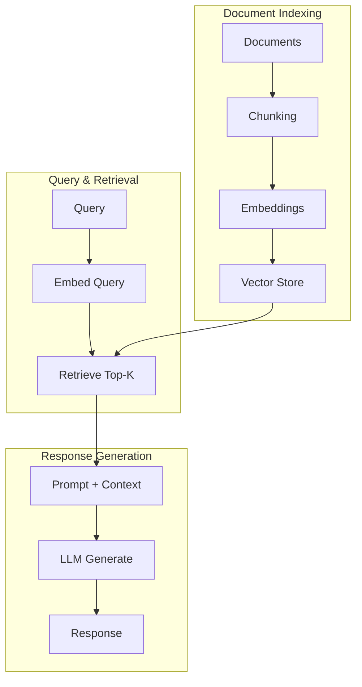

Retrieval-Augmented Generation (RAG) combines the power of large language models with your organization's knowledge base. Instead of relying solely on what the model learned during training, RAG **retrieves relevant documents** and includes them in the prompt for more accurate, up-to-date, and verifiable responses. This guide covers production-ready RAG patterns for RHEL AI.

## RAG Architecture Overview

A RAG system consists of three main components: document processing, retrieval, and generation.

### RAG Pipeline



### When to Use RAG

| Use Case | RAG Benefit | Alternative |
|----------|-------------|-------------|
| **Internal docs** | Access company knowledge | Fine-tuning |
| **Frequent updates** | No retraining needed | Continuous training |
| **Source citation** | Traceable answers | N/A |
| **Domain expertise** | Specialized knowledge | Domain fine-tuning |
| **Compliance** | Auditable responses | N/A |

## Document Processing Pipeline

The quality of your RAG system depends on how well you process and chunk documents.

### Document Loading

```python
#!/usr/bin/env python3
"""document_loader.py - Load documents for RAG"""

from pathlib import Path
from typing import List, Dict
import fitz  # PyMuPDF
from langchain.document_loaders import (
    DirectoryLoader,
    PyPDFLoader,
    TextLoader,
    UnstructuredMarkdownLoader
)

class MultiFormatLoader:
    """Load documents from multiple formats."""
    
    LOADERS = {
        ".pdf": PyPDFLoader,
        ".txt": TextLoader,
        ".md": UnstructuredMarkdownLoader,
        ".html": "unstructured"
    }
    
    def __init__(self, source_dir: str):
        self.source_dir = Path(source_dir)
        self.documents = []
    
    def load_all(self) -> List[Dict]:
        """Load all documents from directory."""
        for file_path in self.source_dir.rglob("*"):
            if file_path.suffix in self.LOADERS:
                docs = self._load_file(file_path)
                self.documents.extend(docs)
        
        return self.documents
    
    def _load_file(self, file_path: Path) -> List[Dict]:
        """Load a single file."""
        loader_class = self.LOADERS.get(file_path.suffix)
        
        if loader_class == "unstructured":
            from langchain.document_loaders import UnstructuredHTMLLoader
            loader = UnstructuredHTMLLoader(str(file_path))
        else:
            loader = loader_class(str(file_path))
        
        docs = loader.load()
        
        # Add metadata
        for doc in docs:
            doc.metadata["source_file"] = str(file_path)
            doc.metadata["file_type"] = file_path.suffix
        
        return docs

# Usage
loader = MultiFormatLoader("/path/to/knowledge-base")
documents = loader.load_all()
print(f"Loaded {len(documents)} documents")
```

### Intelligent Chunking

```python
#!/usr/bin/env python3
"""chunking.py - Smart document chunking strategies"""

from langchain.text_splitter import (
    RecursiveCharacterTextSplitter,
    MarkdownHeaderTextSplitter,
    TokenTextSplitter
)
from typing import List

class SmartChunker:
    """Intelligent chunking based on document structure."""
    
    def __init__(
        self,
        chunk_size: int = 1000,
        chunk_overlap: int = 200,
        model_max_tokens: int = 4096
    ):
        self.chunk_size = chunk_size
        self.chunk_overlap = chunk_overlap
        self.model_max_tokens = model_max_tokens
        
        # Different splitters for different content types
        self.recursive_splitter = RecursiveCharacterTextSplitter(
            chunk_size=chunk_size,
            chunk_overlap=chunk_overlap,
            separators=["\n\n", "\n", ". ", " ", ""]
        )
        
        self.markdown_splitter = MarkdownHeaderTextSplitter(
            headers_to_split_on=[
                ("#", "header_1"),
                ("##", "header_2"),
                ("###", "header_3"),
            ]
        )
        
        self.token_splitter = TokenTextSplitter(
            chunk_size=chunk_size // 4,  # Approximate tokens
            chunk_overlap=chunk_overlap // 4
        )
    
    def chunk_document(self, doc, strategy: str = "auto") -> List:
        """Chunk a document using the appropriate strategy."""
        
        if strategy == "auto":
            strategy = self._detect_strategy(doc)
        
        if strategy == "markdown":
            # First split by headers, then by size
            header_chunks = self.markdown_splitter.split_text(doc.page_content)
            final_chunks = []
            for chunk in header_chunks:
                if len(chunk.page_content) > self.chunk_size:
                    sub_chunks = self.recursive_splitter.split_text(chunk.page_content)
                    for sc in sub_chunks:
                        final_chunks.append({
                            "content": sc,
                            "metadata": {**doc.metadata, **chunk.metadata}
                        })
                else:
                    final_chunks.append({
                        "content": chunk.page_content,
                        "metadata": {**doc.metadata, **chunk.metadata}
                    })
            return final_chunks
        
        elif strategy == "semantic":
            # Use sentence boundaries
            return self._semantic_chunk(doc)
        
        else:  # recursive (default)
            chunks = self.recursive_splitter.split_text(doc.page_content)
            return [
                {"content": c, "metadata": doc.metadata}
                for c in chunks
            ]
    
    def _detect_strategy(self, doc) -> str:
        """Auto-detect best chunking strategy."""
        content = doc.page_content
        
        if content.count("#") > 5:  # Likely markdown
            return "markdown"
        elif doc.metadata.get("file_type") == ".md":
            return "markdown"
        else:
            return "recursive"
    
    def _semantic_chunk(self, doc) -> List:
        """Chunk based on semantic boundaries."""
        import nltk
        nltk.download('punkt', quiet=True)
        
        sentences = nltk.sent_tokenize(doc.page_content)
        chunks = []
        current_chunk = []
        current_length = 0
        
        for sentence in sentences:
            if current_length + len(sentence) > self.chunk_size:
                if current_chunk:
                    chunks.append({
                        "content": " ".join(current_chunk),
                        "metadata": doc.metadata
                    })
                current_chunk = [sentence]
                current_length = len(sentence)
            else:
                current_chunk.append(sentence)
                current_length += len(sentence)
        
        if current_chunk:
            chunks.append({
                "content": " ".join(current_chunk),
                "metadata": doc.metadata
            })
        
        return chunks
```

## Vector Store Setup

Choose and configure the right vector database for your scale and requirements.

### Milvus Setup (Recommended for Production)

```python
#!/usr/bin/env python3
"""milvus_setup.py - Production vector store with Milvus"""

from pymilvus import (
    connections,
    Collection,
    FieldSchema,
    CollectionSchema,
    DataType,
    utility
)

class MilvusVectorStore:
    def __init__(
        self,
        host: str = "localhost",
        port: int = 19530,
        collection_name: str = "knowledge_base"
    ):
        self.collection_name = collection_name
        
        # Connect to Milvus
        connections.connect(host=host, port=port)
        
        # Create collection if not exists
        if not utility.has_collection(collection_name):
            self._create_collection()
        
        self.collection = Collection(collection_name)
        self.collection.load()
    
    def _create_collection(self):
        """Create collection with schema."""
        fields = [
            FieldSchema(name="id", dtype=DataType.INT64, is_primary=True, auto_id=True),
            FieldSchema(name="content", dtype=DataType.VARCHAR, max_length=65535),
            FieldSchema(name="embedding", dtype=DataType.FLOAT_VECTOR, dim=768),
            FieldSchema(name="source", dtype=DataType.VARCHAR, max_length=512),
            FieldSchema(name="chunk_id", dtype=DataType.INT64)
        ]
        
        schema = CollectionSchema(fields, description="RAG knowledge base")
        collection = Collection(self.collection_name, schema)
        
        # Create index for fast similarity search
        index_params = {
            "metric_type": "COSINE",
            "index_type": "IVF_FLAT",
            "params": {"nlist": 1024}
        }
        collection.create_index("embedding", index_params)
    
    def insert(self, chunks: list, embeddings: list):
        """Insert chunks with embeddings."""
        entities = [
            [chunk["content"] for chunk in chunks],
            embeddings,
            [chunk["metadata"].get("source_file", "") for chunk in chunks],
            list(range(len(chunks)))
        ]
        
        self.collection.insert(entities)
        self.collection.flush()
    
    def search(self, query_embedding: list, top_k: int = 5) -> list:
        """Search for similar chunks."""
        search_params = {
            "metric_type": "COSINE",
            "params": {"nprobe": 10}
        }
        
        results = self.collection.search(
            data=[query_embedding],
            anns_field="embedding",
            param=search_params,
            limit=top_k,
            output_fields=["content", "source"]
        )
        
        return [
            {
                "content": hit.entity.get("content"),
                "source": hit.entity.get("source"),
                "score": hit.score
            }
            for hit in results[0]
        ]
```

### ChromaDB for Development

```python
#!/usr/bin/env python3
"""chroma_setup.py - Simple vector store for development"""

import chromadb
from chromadb.config import Settings

class ChromaVectorStore:
    def __init__(self, persist_dir: str = "./chroma_db"):
        self.client = chromadb.Client(Settings(
            persist_directory=persist_dir,
            anonymized_telemetry=False
        ))
        
        self.collection = self.client.get_or_create_collection(
            name="knowledge_base",
            metadata={"hnsw:space": "cosine"}
        )
    
    def add_documents(self, chunks: list, embeddings: list, ids: list = None):
        """Add documents to the collection."""
        if ids is None:
            ids = [f"chunk_{i}" for i in range(len(chunks))]
        
        self.collection.add(
            documents=[c["content"] for c in chunks],
            embeddings=embeddings,
            metadatas=[c["metadata"] for c in chunks],
            ids=ids
        )
    
    def query(self, query_embedding: list, n_results: int = 5) -> list:
        """Query similar documents."""
        results = self.collection.query(
            query_embeddings=[query_embedding],
            n_results=n_results
        )
        
        return [
            {
                "content": doc,
                "metadata": meta,
                "score": 1 - dist  # Convert distance to similarity
            }
            for doc, meta, dist in zip(
                results["documents"][0],
                results["metadatas"][0],
                results["distances"][0]
            )
        ]
```

## Embedding Generation

Generate high-quality embeddings using local models on RHEL AI.

### Local Embedding Model

```python
#!/usr/bin/env python3
"""embeddings.py - Generate embeddings locally"""

from sentence_transformers import SentenceTransformer
import torch
from typing import List
import numpy as np

class LocalEmbeddings:
    """Generate embeddings using local model."""
    
    def __init__(self, model_name: str = "BAAI/bge-large-en-v1.5"):
        self.device = "cuda" if torch.cuda.is_available() else "cpu"
        self.model = SentenceTransformer(model_name, device=self.device)
        self.dimension = self.model.get_sentence_embedding_dimension()
    
    def embed_documents(self, texts: List[str], batch_size: int = 32) -> np.ndarray:
        """Embed multiple documents."""
        embeddings = self.model.encode(
            texts,
            batch_size=batch_size,
            show_progress_bar=True,
            convert_to_numpy=True,
            normalize_embeddings=True
        )
        return embeddings
    
    def embed_query(self, query: str) -> np.ndarray:
        """Embed a single query."""
        # BGE models use instruction prefix for queries
        instruction = "Represent this sentence for searching relevant passages: "
        embedding = self.model.encode(
            instruction + query,
            convert_to_numpy=True,
            normalize_embeddings=True
        )
        return embedding

# Usage
embedder = LocalEmbeddings()
doc_embeddings = embedder.embed_documents(["Document 1", "Document 2"])
query_embedding = embedder.embed_query("What is RHEL AI?")
```

## RAG Query Pipeline

Combine retrieval and generation for the complete RAG experience.

### Complete RAG Implementation

```python
#!/usr/bin/env python3
"""rag_pipeline.py - Complete RAG implementation"""

from typing import List, Optional
import requests

class RAGPipeline:
    """Production RAG pipeline for RHEL AI."""
    
    def __init__(
        self,
        vector_store,
        embedder,
        llm_endpoint: str = "http://localhost:8000/v1",
        model_name: str = "granite-7b-instruct"
    ):
        self.vector_store = vector_store
        self.embedder = embedder
        self.llm_endpoint = llm_endpoint
        self.model_name = model_name
    
    def query(
        self,
        question: str,
        top_k: int = 5,
        include_sources: bool = True
    ) -> dict:
        """Execute RAG query."""
        
        # Step 1: Embed the query
        query_embedding = self.embedder.embed_query(question)
        
        # Step 2: Retrieve relevant documents
        retrieved_docs = self.vector_store.search(query_embedding, top_k)
        
        # Step 3: Build context-aware prompt
        context = self._build_context(retrieved_docs)
        prompt = self._build_prompt(question, context)
        
        # Step 4: Generate response
        response = self._generate(prompt)
        
        result = {
            "question": question,
            "answer": response,
            "context_used": len(retrieved_docs)
        }
        
        if include_sources:
            result["sources"] = [
                {
                    "content": doc["content"][:200] + "...",
                    "source": doc.get("source", "unknown"),
                    "relevance_score": doc["score"]
                }
                for doc in retrieved_docs
            ]
        
        return result
    
    def _build_context(self, docs: List[dict]) -> str:
        """Build context from retrieved documents."""
        context_parts = []
        for i, doc in enumerate(docs, 1):
            source = doc.get("source", "unknown")
            content = doc["content"]
            context_parts.append(f"[Source {i}: {source}]\n{content}")
        
        return "\n\n".join(context_parts)
    
    def _build_prompt(self, question: str, context: str) -> str:
        """Build the complete prompt."""
        return f"""You are a helpful assistant. Answer the question based on the provided context.
If the context doesn't contain enough information to answer the question, say so.
Always cite your sources using [Source N] notation.

Context:
{context}

Question: {question}

Answer:"""
    
    def _generate(self, prompt: str) -> str:
        """Generate response using vLLM."""
        response = requests.post(
            f"{self.llm_endpoint}/chat/completions",
            json={
                "model": self.model_name,
                "messages": [{"role": "user", "content": prompt}],
                "max_tokens": 1000,
                "temperature": 0.1
            }
        )
        
        return response.json()["choices"][0]["message"]["content"]
```

## Advanced RAG Patterns

Enhance retrieval quality with advanced techniques.

### Hybrid Search (Dense + Sparse)

```python
#!/usr/bin/env python3
"""hybrid_search.py - Combine semantic and keyword search"""

from rank_bm25 import BM25Okapi
import numpy as np

class HybridRetriever:
    """Combine dense and sparse retrieval."""
    
    def __init__(self, vector_store, documents: list, alpha: float = 0.5):
        self.vector_store = vector_store
        self.alpha = alpha  # Weight for dense vs sparse
        
        # Build BM25 index
        tokenized_docs = [doc.split() for doc in documents]
        self.bm25 = BM25Okapi(tokenized_docs)
        self.documents = documents
    
    def search(self, query: str, query_embedding: list, top_k: int = 5) -> list:
        """Hybrid search combining dense and sparse."""
        
        # Dense search (semantic)
        dense_results = self.vector_store.search(query_embedding, top_k * 2)
        
        # Sparse search (BM25)
        tokenized_query = query.split()
        bm25_scores = self.bm25.get_scores(tokenized_query)
        sparse_indices = np.argsort(bm25_scores)[::-1][:top_k * 2]
        
        # Normalize and combine scores
        dense_scores = {r["content"]: r["score"] for r in dense_results}
        sparse_scores = {
            self.documents[i]: bm25_scores[i] / max(bm25_scores)
            for i in sparse_indices
        }
        
        # Combine with alpha weighting
        all_docs = set(dense_scores.keys()) | set(sparse_scores.keys())
        combined = []
        
        for doc in all_docs:
            dense = dense_scores.get(doc, 0)
            sparse = sparse_scores.get(doc, 0)
            score = self.alpha * dense + (1 - self.alpha) * sparse
            combined.append({"content": doc, "score": score})
        
        # Sort by combined score
        combined.sort(key=lambda x: x["score"], reverse=True)
        return combined[:top_k]
```

### Query Expansion

```python
#!/usr/bin/env python3
"""query_expansion.py - Expand queries for better retrieval"""

class QueryExpander:
    """Expand queries using LLM-generated variations."""
    
    def __init__(self, llm_endpoint: str):
        self.llm_endpoint = llm_endpoint
    
    def expand(self, query: str, num_variations: int = 3) -> list:
        """Generate query variations."""
        prompt = f"""Generate {num_variations} alternative phrasings of this search query.
Each variation should capture the same intent but use different words.
Return only the variations, one per line.

Original query: {query}

Variations:"""
        
        response = requests.post(
            f"{self.llm_endpoint}/chat/completions",
            json={
                "model": "granite-7b-instruct",
                "messages": [{"role": "user", "content": prompt}],
                "max_tokens": 200,
                "temperature": 0.7
            }
        )
        
        variations = response.json()["choices"][0]["message"]["content"]
        return [query] + [v.strip() for v in variations.strip().split("\n")]
```

### Re-ranking Retrieved Documents

```python
#!/usr/bin/env python3
"""reranker.py - Re-rank retrieved documents"""

from sentence_transformers import CrossEncoder

class DocumentReranker:
    """Re-rank documents using cross-encoder."""
    
    def __init__(self, model_name: str = "cross-encoder/ms-marco-MiniLM-L-6-v2"):
        self.model = CrossEncoder(model_name)
    
    def rerank(self, query: str, documents: list, top_k: int = 5) -> list:
        """Re-rank documents by relevance to query."""
        
        # Score each document
        pairs = [(query, doc["content"]) for doc in documents]
        scores = self.model.predict(pairs)
        
        # Add scores and sort
        for doc, score in zip(documents, scores):
            doc["rerank_score"] = float(score)
        
        documents.sort(key=lambda x: x["rerank_score"], reverse=True)
        return documents[:top_k]
```

## Production Deployment

Deploy your RAG system with proper infrastructure.

### Docker Compose Setup

```yaml
# docker-compose.yml
version: '3.8'

services:
  milvus:
    image: milvusdb/milvus:v2.3-latest
    ports:
      - "19530:19530"
    volumes:
      - milvus_data:/var/lib/milvus
    environment:
      - ETCD_ENDPOINTS=etcd:2379
  
  etcd:
    image: quay.io/coreos/etcd:v3.5.0
    environment:
      - ETCD_AUTO_COMPACTION_MODE=revision
      - ETCD_AUTO_COMPACTION_RETENTION=1000
    volumes:
      - etcd_data:/etcd
  
  vllm:
    image: vllm/vllm-openai:latest
    runtime: nvidia
    ports:
      - "8000:8000"
    command: >
      --model ibm-granite/granite-7b-instruct
      --tensor-parallel-size 1
  
  rag-api:
    build: ./rag-service
    ports:
      - "8080:8080"
    environment:
      - MILVUS_HOST=milvus
      - VLLM_ENDPOINT=http://vllm:8000/v1
    depends_on:
      - milvus
      - vllm

volumes:
  milvus_data:
  etcd_data:
```

## Related Book Content

This article covers material from:
- **Chapter 5: Custom Applications** - Vector stores and RAG implementation
- **Chapter 7: Use Cases** - RAG chatbot deployment
- **Chapter 4: Advanced Features** - vLLM integration for generation

---

## 📚 Build Intelligent Knowledge Systems

**Want to connect AI to your data?**

*Practical RHEL AI* provides complete RAG guidance:

- ✅ Step-by-step vector store setup
- ✅ Document processing pipelines
- ✅ Hybrid search implementation
- ✅ Production deployment patterns
- ✅ Performance optimization techniques

<div style="background: linear-gradient(135deg, #ee0000 0%, #cc0000 100%); padding: 2rem; border-radius: 12px; text-align: center; margin: 2rem 0;">
  <h3 style="color: white; margin-bottom: 1rem;">🔍 Connect AI to Your Knowledge</h3>
  <p style="color: white; margin-bottom: 1.5rem;"><strong>Practical RHEL AI</strong> teaches you to build RAG systems that make your AI smarter with your organization's data.</p>
  <a href="/books/" style="display: inline-block; background: white; color: #cc0000; padding: 0.75rem 2rem; border-radius: 8px; font-weight: bold; text-decoration: none; margin-right: 1rem;">Learn More →</a>
  <a href="https://amzn.to/4qjORdC" style="display: inline-block; background: #ff9900; color: #111; padding: 0.75rem 2rem; border-radius: 8px; font-weight: bold; text-decoration: none;">Buy on Amazon →</a>
</div>
