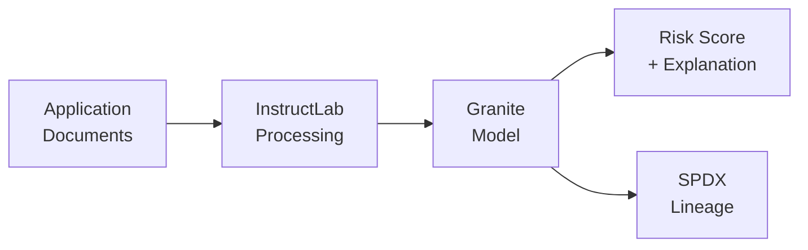
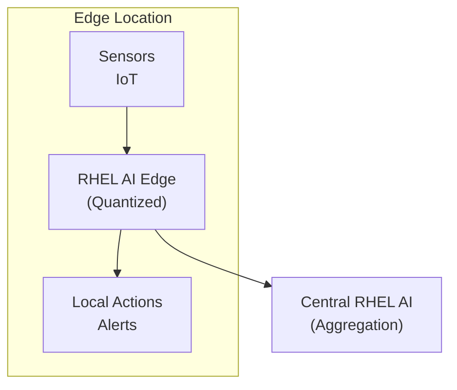

> **📘 Book Reference:** This article is based on **Chapter 7: Use Cases** of [Practical RHEL AI](/books/), showcasing real-world enterprise applications running on Red Hat Enterprise Linux AI.

## Introduction

Chapter 7 of *Practical RHEL AI* presents four comprehensive use cases that demonstrate the platform's versatility for enterprise AI workloads. Each case study includes architecture patterns, implementation details, and production considerations.

## Use Case 1: Underwriting Classification

### Business Context

Insurance companies process thousands of applications daily, requiring consistent risk assessment. RHEL AI enables automated underwriting classification with explainable decisions.

### Architecture



### Implementation

```python
from instructlab import Classifier
from vllm import LLM

# Load fine-tuned underwriting model
model = LLM(
    model="granite-underwriting-v1",
    tensor_parallel_size=2
)

def classify_application(application_data):
    prompt = f"""
    Analyze this insurance application and provide:
    1. Risk classification (Low/Medium/High)
    2. Key risk factors identified
    3. Recommended premium adjustment
    
    Application: {application_data}
    """
    
    response = model.generate(prompt, max_tokens=500)
    return parse_classification(response)
```

### Results

| Metric | Before RHEL AI | After RHEL AI |
|--------|---------------|---------------|
| Processing Time | 15 minutes | 30 seconds |
| Consistency | 78% | 95% |
| Appeal Rate | 12% | 4% |

## Use Case 2: Multilingual Chatbots

### Business Context

Global enterprises need customer support in multiple languages. RHEL AI supports fine-tuning for domain-specific multilingual capabilities.

### Supported Languages

The Granite and Mixtral models support:
- English, Spanish, French, German, Italian
- Portuguese, Dutch, Chinese, Japanese, Korean
- Arabic, Hindi, and 20+ additional languages

### Implementation

```yaml
# taxonomy/multilingual-support/qna.yaml
created_by: enterprise-team
version: 1
seed_examples:
  - context: |
      Customer inquiries about product returns in Spanish
    question: "¿Cómo puedo devolver un producto?"
    answer: |
      Para devolver un producto, siga estos pasos:
      1. Inicie sesión en su cuenta
      2. Vaya a 'Mis pedidos'
      3. Seleccione el artículo a devolver
      4. Complete el formulario de devolución
```

### Deployment with vLLM

```python
from vllm import LLM, SamplingParams

# Multi-language chatbot configuration
chatbot = LLM(
    model="granite-multilingual-chat",
    tensor_parallel_size=4,
    max_model_len=8192
)

# Language detection and routing
def handle_query(user_message, detected_language):
    system_prompt = get_system_prompt(detected_language)
    
    response = chatbot.generate(
        prompts=[f"{system_prompt}\n\nUser: {user_message}"],
        sampling_params=SamplingParams(
            temperature=0.3,
            max_tokens=1024
        )
    )
    return response
```

## Use Case 3: RAG (Retrieval-Augmented Generation)

### Business Context

Enterprises need AI that can answer questions using proprietary documentation while maintaining accuracy and providing citations.

### Architecture Components

As detailed in Chapter 7:
- **Vector Store**: Milvus or Chroma for embeddings
- **Embedding Model**: Granite embeddings
- **LLM**: Fine-tuned Granite for response generation
- **RHEL AI**: Orchestration and serving

### Implementation

```python
from langchain.vectorstores import Milvus
from langchain.embeddings import HuggingFaceEmbeddings
from vllm import LLM

# Initialize vector store
embeddings = HuggingFaceEmbeddings(
    model_name="granite-embedding-v1"
)

vectorstore = Milvus(
    embedding_function=embeddings,
    connection_args={"host": "localhost", "port": "19530"},
    collection_name="enterprise_docs"
)

# RAG pipeline
def answer_with_sources(query):
    # Retrieve relevant documents
    docs = vectorstore.similarity_search(query, k=5)
    
    # Generate response with citations
    context = "\n".join([doc.page_content for doc in docs])
    
    prompt = f"""
    Answer based on the following context. Include citations.
    
    Context: {context}
    
    Question: {query}
    """
    
    response = llm.generate(prompt)
    return response, docs
```

### Performance Metrics

| Metric | Target | Achieved |
|--------|--------|----------|
| Response Time | less than 3s | 2.1s |
| Accuracy | greater than 90% | 94% |
| Citation Rate | 100% | 100% |

## Use Case 4: Edge Sentiment Analysis

### Business Context

Retail and hospitality need real-time sentiment analysis at edge locations for immediate customer feedback processing.

### Edge Deployment Architecture



### Quantized Model for Edge

```python
from optimum.intel import OVQuantizer
from transformers import AutoModelForSequenceClassification

# Quantize for edge deployment
model = AutoModelForSequenceClassification.from_pretrained(
    "granite-sentiment-v1"
)

quantizer = OVQuantizer.from_pretrained(model)
quantizer.quantize(
    save_directory="./edge-sentiment-int8",
    quantization_config={"bits": 8}
)
```

### Real-Time Processing

```python
import asyncio
from collections import deque

class EdgeSentimentProcessor:
    def __init__(self, model_path):
        self.model = load_quantized_model(model_path)
        self.recent_sentiments = deque(maxlen=100)
        self.alert_threshold = 0.3  # Negative sentiment ratio
    
    async def process_feedback(self, text):
        sentiment = self.model.predict(text)
        self.recent_sentiments.append(sentiment)
        
        # Check for negative trend
        if self.calculate_negative_ratio() > self.alert_threshold:
            await self.trigger_alert()
        
        return sentiment
```

## Cross-Cutting Concerns

### SPDX Lineage Tracking

All use cases implement SPDX lineage tracking for model provenance:

```json
{
  "SPDXID": "SPDXRef-Model-Underwriting-v1",
  "spdxVersion": "SPDX-2.3",
  "name": "granite-underwriting-v1",
  "downloadLocation": "registry.redhat.io/rhel-ai/models",
  "relationships": [
    {
      "spdxElementId": "SPDXRef-BaseModel",
      "relatedSpdxElement": "SPDXRef-Granite-3B",
      "relationshipType": "DERIVED_FROM"
    }
  ]
}
```

### Ansible Automation

Deploy any use case with Ansible:

```yaml
# deploy-use-case.yml
- name: Deploy RHEL AI Use Case
  hosts: ai_servers
  vars:
    use_case: "underwriting"
    model_version: "v1.2"
  
  tasks:
    - name: Pull model container
      containers.podman.podman_image:
        name: "registry.redhat.io/rhel-ai/{{ use_case }}"
        tag: "{{ model_version }}"
    
    - name: Deploy vLLM service
      ansible.builtin.include_role:
        name: rhel_ai_vllm
```

## Related Book Content

This article covers material from:
- **Chapter 7: Use Cases** - All four enterprise applications
- **Chapter 5: Custom Applications** - Vector stores, Ansible deployment
- **Chapter 6: Monitoring** - Production metrics

---

## 📚 Implement Real-World AI Solutions

**Ready to deploy AI for your business?**

*Practical RHEL AI* includes complete use case implementations:

- ✅ Underwriting classification with explainability
- ✅ Multilingual chatbot deployment guides
- ✅ RAG pipelines with vector stores
- ✅ Edge sentiment analysis patterns
- ✅ Production deployment checklists

<div style="background: linear-gradient(135deg, #ee0000 0%, #cc0000 100%); padding: 2rem; border-radius: 12px; text-align: center; margin: 2rem 0;">
  <h3 style="color: white; margin-bottom: 1rem;">🎯 Solve Real Business Problems</h3>
  <p style="color: white; margin-bottom: 1.5rem;"><strong>Practical RHEL AI</strong> provides production-tested patterns for enterprise AI applications across industries.</p>
  <a href="/books/" style="display: inline-block; background: white; color: #cc0000; padding: 0.75rem 2rem; border-radius: 8px; font-weight: bold; text-decoration: none; margin-right: 1rem;">Learn More →</a>
  <a href="https://amzn.to/4qjORdC" style="display: inline-block; background: #ff9900; color: #111; padding: 0.75rem 2rem; border-radius: 8px; font-weight: bold; text-decoration: none;">Buy on Amazon →</a>
</div>
