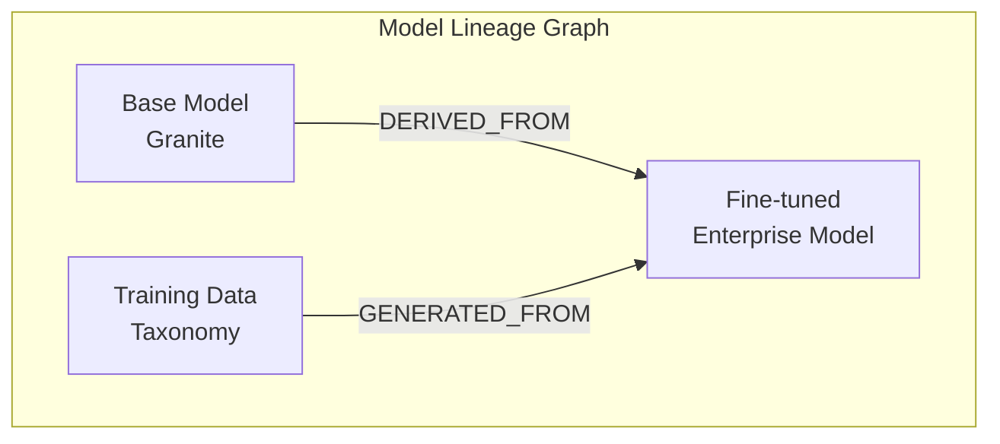

> **📘 Book Reference:** This article is based on **Chapters 4 and 8** of [Practical RHEL AI](/books/), covering SPDX lineage tracking for enterprise AI governance and compliance.

## Introduction

As AI systems become subject to increasing regulatory scrutiny, organizations need robust methods to track model provenance. **SPDX (Software Package Data Exchange)** provides a standardized format for documenting the lineage of AI models—from training data to deployed artifacts.

*Practical RHEL AI* introduces SPDX lineage tracking as a key governance feature, ensuring enterprises can:
- Trace model weights back to their origins
- Document training data sources
- Comply with emerging AI regulations
- Enable reproducible AI pipelines

## What is SPDX?

SPDX is an open standard for communicating software bill of materials (SBOM) information. For AI, it extends to:

| Component | SPDX Documentation |
|-----------|-------------------|
| Base Model | Origin, license, version |
| Training Data | Sources, licenses, transformations |
| Fine-tuning | Parameters, taxonomy, timestamps |
| Deployed Model | Checksums, environment, dependencies |

## Creating Model SPDX Documents

### Basic Structure

```json
{
  "spdxVersion": "SPDX-2.3",
  "dataLicense": "CC0-1.0",
  "SPDXID": "SPDXRef-DOCUMENT",
  "name": "granite-enterprise-v1-model-sbom",
  "documentNamespace": "https://example.com/models/granite-enterprise-v1",
  "creationInfo": {
    "created": "2024-01-15T10:30:00Z",
    "creators": [
      "Organization: Acme Corp",
      "Tool: RHEL AI InstructLab-1.0"
    ]
  },
  "packages": []
}
```

### Documenting Base Model

```json
{
  "SPDXID": "SPDXRef-BaseModel",
  "name": "granite-3b-instruct",
  "versionInfo": "2024.1",
  "supplier": "Organization: IBM",
  "downloadLocation": "https://huggingface.co/ibm/granite-3b-instruct",
  "filesAnalyzed": false,
  "licenseConcluded": "Apache-2.0",
  "licenseDeclared": "Apache-2.0",
  "copyrightText": "Copyright 2024 IBM",
  "checksums": [
    {
      "algorithm": "SHA256",
      "checksumValue": "a1b2c3d4e5f6..."
    }
  ]
}
```

### Documenting Training Data

```json
{
  "SPDXID": "SPDXRef-TrainingData",
  "name": "enterprise-taxonomy-v1",
  "versionInfo": "1.0.0",
  "supplier": "Organization: Acme Corp",
  "downloadLocation": "NOASSERTION",
  "filesAnalyzed": true,
  "licenseConcluded": "LicenseRef-Proprietary",
  "copyrightText": "Copyright 2024 Acme Corp",
  "comment": "Internal taxonomy with 500 skill definitions",
  "annotations": [
    {
      "annotationType": "OTHER",
      "annotator": "Tool: InstructLab",
      "annotationDate": "2024-01-10T14:00:00Z",
      "comment": "Synthetic data generated: 50,000 examples"
    }
  ]
}
```

### Documenting Fine-tuned Model

```json
{
  "SPDXID": "SPDXRef-FineTunedModel",
  "name": "granite-enterprise-v1",
  "versionInfo": "1.0.0",
  "supplier": "Organization: Acme Corp",
  "downloadLocation": "registry.acme.com/models/granite-enterprise-v1",
  "licenseConcluded": "LicenseRef-Proprietary",
  "checksums": [
    {
      "algorithm": "SHA256",
      "checksumValue": "f6e5d4c3b2a1..."
    }
  ],
  "externalRefs": [
    {
      "referenceCategory": "OTHER",
      "referenceType": "mlflow-run-id",
      "referenceLocator": "runs:/abc123/artifacts/model"
    }
  ]
}
```

## Relationship Mapping

Document how components relate:

```json
{
  "relationships": [
    {
      "spdxElementId": "SPDXRef-FineTunedModel",
      "relatedSpdxElement": "SPDXRef-BaseModel",
      "relationshipType": "DERIVED_FROM"
    },
    {
      "spdxElementId": "SPDXRef-FineTunedModel",
      "relatedSpdxElement": "SPDXRef-TrainingData",
      "relationshipType": "GENERATED_FROM"
    },
    {
      "spdxElementId": "SPDXRef-FineTunedModel",
      "relatedSpdxElement": "SPDXRef-DeepSpeedConfig",
      "relationshipType": "BUILD_TOOL_OF"
    }
  ]
}
```

### Relationship Visualization



## Automated SPDX Generation

### InstructLab Integration

Generate SPDX documents during training:

```python
from instructlab.spdx import SPDXGenerator

# Initialize generator
spdx_gen = SPDXGenerator(
    organization="Acme Corp",
    namespace_base="https://acme.com/models"
)

# After training completes
spdx_document = spdx_gen.generate(
    model_name="granite-enterprise-v1",
    base_model="granite-3b-instruct",
    training_data_path="./taxonomy",
    output_model_path="./output/model",
    training_config="./ds_config.json"
)

# Save document
spdx_gen.save(spdx_document, "./sbom/model-sbom.spdx.json")
```

### CI/CD Integration

```yaml
# .gitlab-ci.yml
stages:
  - train
  - document
  - validate
  - deploy

generate_sbom:
  stage: document
  script:
    - python generate_spdx.py
    - spdx-tools verify sbom/model-sbom.spdx.json
  artifacts:
    paths:
      - sbom/model-sbom.spdx.json

validate_lineage:
  stage: validate
  script:
    - python validate_lineage.py sbom/model-sbom.spdx.json
    - |
      if [ $? -ne 0 ]; then
        echo "Lineage validation failed"
        exit 1
      fi
```

## Compliance Requirements

### EU AI Act Alignment

The EU AI Act requires documentation of:
- Training data sources
- Model modifications
- Risk assessments
- Human oversight measures

SPDX addresses these through:

```json
{
  "SPDXID": "SPDXRef-RiskAssessment",
  "name": "risk-assessment-v1",
  "annotations": [
    {
      "annotationType": "REVIEW",
      "annotator": "Person: Jane Smith (Risk Officer)",
      "annotationDate": "2024-01-20T09:00:00Z",
      "comment": "Risk level: LIMITED. Approved for production use in customer service scenarios."
    }
  ]
}
```

### Industry Standards Mapping

| Standard | SPDX Support |
|----------|-------------|
| EU AI Act | Full |
| NIST AI RMF | Partial |
| ISO/IEC 42001 | Full |
| SOC 2 | Partial |

## Querying Lineage

### Python Query Library

```python
from spdx_tools.spdx.parser import parse_from_file
from spdx_tools.spdx.model import RelationshipType

def get_model_ancestry(spdx_file, model_id):
    """Trace model back to its origins."""
    document = parse_from_file(spdx_file)
    
    ancestry = []
    current = model_id
    
    while current:
        package = find_package(document, current)
        ancestry.append(package)
        
        # Find DERIVED_FROM relationship
        parent = find_relationship(
            document, 
            current, 
            RelationshipType.DERIVED_FROM
        )
        current = parent
    
    return ancestry

# Example usage
ancestry = get_model_ancestry(
    "sbom/model-sbom.spdx.json",
    "SPDXRef-FineTunedModel"
)

for model in ancestry:
    print(f"- {model.name} v{model.version_info}")
```

### Output

```
Model Ancestry:
- granite-enterprise-v1 v1.0.0
- granite-3b-instruct v2024.1
- granite-base-3b v1.0.0 (IBM Research)
```

## Best Practices

### From Chapter 8

1. **Generate SPDX at every training run** - Automate in CI/CD
2. **Include checksums** - Enable verification of model weights
3. **Document synthetic data** - Track generated training examples
4. **Link to MLflow/W&B runs** - Connect to experiment tracking
5. **Review relationships** - Ensure DERIVED_FROM chains are complete
6. **Store SPDX with models** - Co-locate documentation and artifacts

### Storage Pattern

```
models/
├── granite-enterprise-v1/
│   ├── model.safetensors
│   ├── config.json
│   ├── tokenizer.json
│   └── sbom/
│       ├── model-sbom.spdx.json
│       ├── training-data-sbom.spdx.json
│       └── dependencies-sbom.spdx.json
```

## Related Book Content

This article covers material from:
- **Chapter 4: Advanced Features** - SPDX lineage tracking
- **Chapter 8: Future Trends** - Compliance and governance evolution
- **Chapter 6: Monitoring** - Audit logging integration

---

## Master AI Governance & Compliance

**Need bulletproof model provenance tracking?**

*Practical RHEL AI* covers SPDX and governance comprehensively:

- ✅ Complete SPDX document templates
- ✅ CI/CD integration for automated SBOM generation
- ✅ EU AI Act compliance frameworks
- ✅ Model lineage query tools
- ✅ Audit trail best practices

<div style="background: linear-gradient(135deg, #ee0000 0%, #cc0000 100%); padding: 2rem; border-radius: 12px; text-align: center; margin: 2rem 0;">
  <h3 style="color: white; margin-bottom: 1rem;">📜 Prove Your Model's Provenance</h3>
  <p style="color: white; margin-bottom: 1.5rem;"><strong>Practical RHEL AI</strong> gives you the tools to track, audit, and prove compliance for every model you deploy.</p>
  <a href="/books/" style="display: inline-block; background: white; color: #cc0000; padding: 0.75rem 2rem; border-radius: 8px; font-weight: bold; text-decoration: none; margin-right: 1rem;">Learn More →</a>
  <a href="https://amzn.to/4qjORdC" style="display: inline-block; background: #ff9900; color: #111; padding: 0.75rem 2rem; border-radius: 8px; font-weight: bold; text-decoration: none;">Buy on Amazon →</a>
</div>
