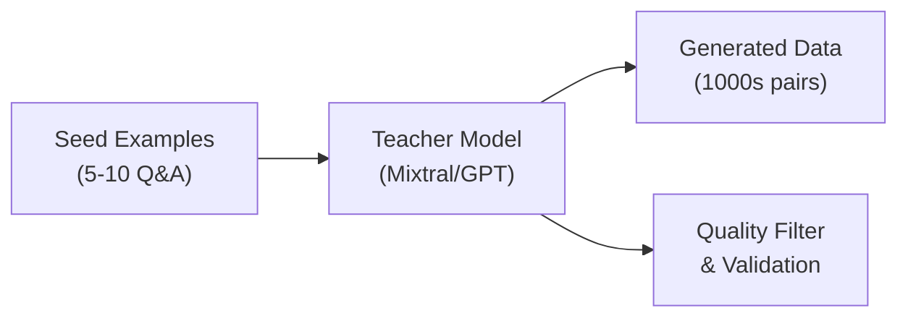

Synthetic data generation (SDG) is the secret weapon that makes InstructLab fine-tuning so effective. Instead of requiring thousands of manually created examples, SDG uses **teacher models** to generate diverse, high-quality training data from just a handful of seed examples. This article explores how to leverage SDG effectively on RHEL AI.

## Understanding the SDG Pipeline

InstructLab's SDG pipeline transforms your seed examples into a rich training dataset through a sophisticated multi-stage process.

### The SDG Architecture



### How SDG Works

The synthetic data generation process follows these steps:

1. **Context Extraction**: Extract key concepts from your taxonomy YAML
2. **Prompt Construction**: Build diverse prompts from seed examples
3. **Teacher Generation**: Large model generates variations
4. **Quality Filtering**: Remove low-quality or duplicate examples
5. **Format Conversion**: Prepare data for training

## Configuring Teacher Models

Teacher models are the backbone of synthetic data quality. RHEL AI supports multiple teacher configurations.

### Default Teacher Configuration

```yaml
# ~/.config/instructlab/config.yaml
generate:
  teacher:
    model_path: mixtral-8x7b-instruct
    backend: vllm
    api_base: http://localhost:8000/v1
  
  # Generation parameters
  num_instructions_to_generate: 1000
  temperature: 0.7
  top_p: 0.95
  max_tokens: 2048
```

### Using Remote Teachers

For higher quality synthetic data, use larger remote models:

```yaml
generate:
  teacher:
    model_path: gpt-4-turbo
    api_base: https://api.openai.com/v1
    api_key: ${OPENAI_API_KEY}
  
  # Adjust for API rate limits
  batch_size: 10
  request_delay: 0.5
```

### Local vs. Remote Trade-offs

| Aspect | Local Teacher | Remote Teacher |
|--------|---------------|----------------|
| **Cost** | GPU compute only | Per-token API cost |
| **Speed** | ~100 examples/min | ~20 examples/min |
| **Quality** | Good (Mixtral) | Excellent (GPT-4) |
| **Privacy** | Data stays local | Data sent to API |
| **Scale** | Limited by GPU | Unlimited |

## Writing Effective Seed Examples

The quality of your seed examples directly impacts SDG output. Follow these guidelines for optimal results.

### Seed Example Structure

```yaml
# taxonomy/knowledge/medical/qna.yaml
created_by: medical-team
version: 3
domain: medical_diagnosis
seed_examples:
  - context: |
      Diabetes mellitus is a metabolic disease characterized by 
      elevated blood glucose levels. Type 2 diabetes accounts for 
      approximately 90-95% of all diabetes cases and is often 
      associated with obesity and sedentary lifestyle.
    questions_and_answers:
      - question: What percentage of diabetes cases are Type 2?
        answer: |
          Type 2 diabetes accounts for approximately 90-95% of all 
          diabetes cases. It is the most common form and is often 
          linked to lifestyle factors such as obesity and lack of 
          physical activity.
      
      - question: What are the main risk factors for Type 2 diabetes?
        answer: |
          The main risk factors for Type 2 diabetes include obesity, 
          sedentary lifestyle, family history of diabetes, age over 45, 
          and certain ethnic backgrounds with higher genetic predisposition.
```

### Best Practices for Seed Examples

1. **Diverse Question Types**: Mix factual, analytical, and procedural questions
2. **Varying Complexity**: Include simple and complex examples
3. **Complete Answers**: Provide thorough, well-structured responses
4. **Domain Vocabulary**: Use authentic terminology consistently
5. **Multiple Perspectives**: Cover different aspects of each topic

### Anti-Patterns to Avoid

```yaml
# ❌ BAD: Too simple, lacks context
seed_examples:
  - question: What is diabetes?
    answer: A disease with high blood sugar.

# ❌ BAD: Leading questions
seed_examples:
  - question: Isn't diabetes caused by eating too much sugar?
    answer: Yes, eating sugar causes diabetes.

# ✅ GOOD: Contextual, balanced, detailed
seed_examples:
  - context: |
      Research on diabetes causation has evolved significantly...
    questions_and_answers:
      - question: What factors contribute to Type 2 diabetes development?
        answer: |
          Multiple factors contribute to Type 2 diabetes development,
          including genetic predisposition, obesity, physical inactivity,
          and metabolic syndrome. While diet plays a role, it's more about
          overall caloric intake and dietary patterns than any single food.
```

## Running the SDG Pipeline

Execute synthetic data generation with fine-grained control over the process.

### Basic Generation

```bash
# Generate synthetic data from taxonomy
ilab data generate \
  --taxonomy-path ./taxonomy \
  --output-dir ./generated-data \
  --num-instructions 1000

# Monitor progress
tail -f ~/.local/share/instructlab/logs/generate.log
```

### Advanced Generation Options

```bash
# Full control over SDG parameters
ilab data generate \
  --taxonomy-path ./taxonomy \
  --output-dir ./generated-data \
  --num-instructions 2000 \
  --teacher-model mixtral-8x7b-instruct \
  --temperature 0.8 \
  --top-p 0.92 \
  --max-tokens 3000 \
  --batch-size 50 \
  --num-cpus 8 \
  --chunk-word-count 1000 \
  --pipeline full
```

### Pipeline Stages

```bash
# Run specific pipeline stages
ilab data generate --pipeline simple    # Basic Q&A generation
ilab data generate --pipeline full      # Complete with filtering
ilab data generate --pipeline knowledge # Knowledge-focused

# Resume from checkpoint
ilab data generate \
  --resume-from-checkpoint ./checkpoints/stage2
```

## Quality Validation and Filtering

Not all generated data is created equal. Implement robust quality controls.

### Automatic Quality Filters

InstructLab applies several built-in filters:

```python
# Example quality metrics (internal)
quality_thresholds = {
    "min_answer_length": 50,      # Minimum characters
    "max_answer_length": 4000,    # Maximum characters
    "min_question_length": 10,    # Minimum question length
    "perplexity_threshold": 100,  # Language model perplexity
    "duplicate_threshold": 0.85,  # Similarity threshold
    "toxicity_threshold": 0.1     # Content safety score
}
```

### Custom Validation Script

```python
#!/usr/bin/env python3
"""validate_sdg_output.py - Validate synthetic data quality"""

import json
from pathlib import Path
from collections import Counter
import re

def load_generated_data(path: str) -> list:
    """Load generated JSONL data."""
    data = []
    with open(path, 'r') as f:
        for line in f:
            data.append(json.loads(line))
    return data

def calculate_metrics(data: list) -> dict:
    """Calculate quality metrics for generated data."""
    metrics = {
        "total_examples": len(data),
        "avg_question_length": 0,
        "avg_answer_length": 0,
        "unique_questions": 0,
        "domain_coverage": Counter(),
        "quality_issues": []
    }
    
    questions = []
    total_q_len = 0
    total_a_len = 0
    
    for item in data:
        q = item.get("question", "")
        a = item.get("answer", "")
        
        questions.append(q.lower().strip())
        total_q_len += len(q)
        total_a_len += len(a)
        
        # Check for quality issues
        if len(a) < 50:
            metrics["quality_issues"].append(f"Short answer: {q[:50]}...")
        if len(q) < 10:
            metrics["quality_issues"].append(f"Short question: {q}")
        if re.search(r'\b(I think|maybe|probably)\b', a, re.I):
            metrics["quality_issues"].append(f"Uncertain language: {q[:50]}...")
    
    metrics["avg_question_length"] = total_q_len / len(data)
    metrics["avg_answer_length"] = total_a_len / len(data)
    metrics["unique_questions"] = len(set(questions))
    metrics["duplicate_rate"] = 1 - (metrics["unique_questions"] / len(data))
    
    return metrics

def main():
    data = load_generated_data("./generated-data/train.jsonl")
    metrics = calculate_metrics(data)
    
    print("=== SDG Quality Report ===")
    print(f"Total Examples: {metrics['total_examples']}")
    print(f"Unique Questions: {metrics['unique_questions']}")
    print(f"Duplicate Rate: {metrics['duplicate_rate']:.2%}")
    print(f"Avg Question Length: {metrics['avg_question_length']:.0f} chars")
    print(f"Avg Answer Length: {metrics['avg_answer_length']:.0f} chars")
    
    if metrics["quality_issues"]:
        print(f"\n⚠️  Quality Issues Found: {len(metrics['quality_issues'])}")
        for issue in metrics["quality_issues"][:10]:
            print(f"  - {issue}")

if __name__ == "__main__":
    main()
```

### Human-in-the-Loop Validation

For critical domains, implement human review:

```bash
# Export sample for review
ilab data generate \
  --output-dir ./generated-data \
  --export-for-review ./review-sample.csv \
  --sample-size 100

# After review, filter approved examples
python filter_approved.py \
  --input ./generated-data/train.jsonl \
  --approved ./review-sample-approved.csv \
  --output ./filtered-data/train.jsonl
```

## Scaling SDG for Large Datasets

When you need thousands of high-quality examples, optimize for throughput and quality.

### Parallel Generation

```bash
# Distribute across multiple GPUs
export CUDA_VISIBLE_DEVICES=0,1,2,3

ilab data generate \
  --num-instructions 10000 \
  --batch-size 100 \
  --num-cpus 32 \
  --distributed
```

### Chunked Processing

```python
#!/usr/bin/env python3
"""chunked_sdg.py - Process large taxonomies in chunks"""

import subprocess
from pathlib import Path
import yaml

def chunk_taxonomy(taxonomy_path: str, chunk_size: int = 10):
    """Split large taxonomy into processable chunks."""
    taxonomy = yaml.safe_load(Path(taxonomy_path).read_text())
    seeds = taxonomy.get("seed_examples", [])
    
    chunks = []
    for i in range(0, len(seeds), chunk_size):
        chunk = taxonomy.copy()
        chunk["seed_examples"] = seeds[i:i+chunk_size]
        chunks.append(chunk)
    
    return chunks

def process_chunks(chunks: list, output_dir: str):
    """Process each chunk and merge results."""
    all_data = []
    
    for i, chunk in enumerate(chunks):
        chunk_path = f"/tmp/chunk_{i}.yaml"
        chunk_output = f"{output_dir}/chunk_{i}"
        
        # Write chunk
        with open(chunk_path, 'w') as f:
            yaml.dump(chunk, f)
        
        # Generate
        subprocess.run([
            "ilab", "data", "generate",
            "--taxonomy-path", chunk_path,
            "--output-dir", chunk_output,
            "--num-instructions", "500"
        ])
        
        # Collect results
        # ... merge logic ...
    
    return all_data
```

## Troubleshooting SDG Issues

Common problems and their solutions when running synthetic data generation.

### Low Quality Output

```bash
# Symptoms: Generic, repetitive, or off-topic answers

# Solutions:
# 1. Improve seed example quality
# 2. Add more context to examples
# 3. Use higher-quality teacher model
# 4. Adjust temperature (try 0.6-0.8)
# 5. Increase max_tokens for longer answers

ilab data generate \
  --temperature 0.7 \
  --max-tokens 3000 \
  --teacher-model gpt-4-turbo
```

### High Duplicate Rate

```bash
# Symptoms: Many similar questions generated

# Solutions:
# 1. Increase diversity in seed examples
# 2. Adjust top_p for more varied sampling
# 3. Add more seed examples (minimum 5-10)
# 4. Enable duplicate filtering

ilab data generate \
  --top-p 0.95 \
  --enable-dedup \
  --dedup-threshold 0.8
```

### Memory Issues

```bash
# Symptoms: OOM errors during generation

# Solutions:
# 1. Reduce batch size
# 2. Use quantized teacher model
# 3. Enable gradient checkpointing

ilab data generate \
  --batch-size 10 \
  --teacher-quantization int8
```

## Related Book Content

This article covers material from:
- **Chapter 3: Core Components** - InstructLab SDG pipeline architecture
- **Chapter 4: Advanced Features** - Teacher model configuration
- **Chapter 5: Custom Applications** - Domain-specific data generation

---

## 📚 Master Synthetic Data Generation

**Want to create perfect training data?**

*Practical RHEL AI* provides complete SDG guidance:

- ✅ Step-by-step SDG pipeline tutorials
- ✅ Teacher model selection strategies
- ✅ Quality validation frameworks
- ✅ Scaling techniques for large datasets
- ✅ Domain-specific generation patterns

<div style="background: linear-gradient(135deg, #ee0000 0%, #cc0000 100%); padding: 2rem; border-radius: 12px; text-align: center; margin: 2rem 0;">
  <h3 style="color: white; margin-bottom: 1rem;">🎯 Generate Perfect Training Data</h3>
  <p style="color: white; margin-bottom: 1.5rem;"><strong>Practical RHEL AI</strong> teaches you to create high-quality synthetic datasets that make your fine-tuned models shine.</p>
  <a href="/books/" style="display: inline-block; background: white; color: #cc0000; padding: 0.75rem 2rem; border-radius: 8px; font-weight: bold; text-decoration: none; margin-right: 1rem;">Learn More →</a>
  <a href="https://amzn.to/4qjORdC" style="display: inline-block; background: #ff9900; color: #111; padding: 0.75rem 2rem; border-radius: 8px; font-weight: bold; text-decoration: none;">Buy on Amazon →</a>
</div>
