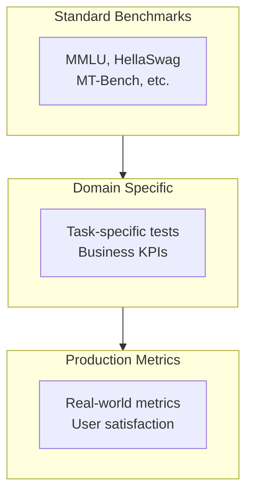

How do you know if your fine-tuned model is actually better? **Model evaluation and benchmarking** are critical steps that separate hobby projects from production-ready AI systems. This guide covers the evaluation techniques, benchmarks, and quality metrics you need to validate your RHEL AI models.

## The Evaluation Framework

Comprehensive model evaluation requires multiple perspectives: academic benchmarks, domain-specific tests, and production metrics.

### Evaluation Pyramid



### When to Evaluate

| Phase | Evaluation Type | Purpose |
|-------|-----------------|---------|
| **Pre-training** | Base benchmarks | Establish baseline |
| **Post-SDG** | Data quality metrics | Validate training data |
| **Post-training** | Full benchmark suite | Measure improvement |
| **Pre-deployment** | Domain evaluation | Validate business fit |
| **Production** | Continuous metrics | Monitor drift |

## MMLU Benchmarking

The Massive Multitask Language Understanding (MMLU) benchmark is the gold standard for measuring model knowledge.

### Running MMLU with InstructLab

```bash
# Run MMLU evaluation
ilab model evaluate \
  --model-path ./fine-tuned-models/granite-medical \
  --benchmark mmlu \
  --output-dir ./evaluations

# With specific subjects
ilab model evaluate \
  --model-path ./fine-tuned-models/granite-medical \
  --benchmark mmlu \
  --subjects medical_genetics,anatomy,clinical_knowledge
```

### MMLU Subjects for Domain Validation

```python
#!/usr/bin/env python3
"""mmlu_subjects.py - Domain-relevant MMLU subjects"""

DOMAIN_SUBJECTS = {
    "medical": [
        "anatomy",
        "clinical_knowledge", 
        "college_medicine",
        "medical_genetics",
        "professional_medicine",
        "college_biology"
    ],
    "legal": [
        "professional_law",
        "jurisprudence",
        "international_law"
    ],
    "finance": [
        "professional_accounting",
        "business_ethics",
        "management"
    ],
    "technical": [
        "computer_security",
        "machine_learning",
        "college_computer_science",
        "electrical_engineering"
    ]
}

def get_subjects_for_domain(domain: str) -> list:
    """Get relevant MMLU subjects for a domain."""
    return DOMAIN_SUBJECTS.get(domain, [])
```

### Interpreting MMLU Results

```
MMLU Evaluation Results
=======================
Model: granite-medical-7b
Date: 2025-12-24

Subject Scores:
┌─────────────────────────┬──────────┬──────────┐
│ Subject                 │ Baseline │ Finetune │
├─────────────────────────┼──────────┼──────────┤
│ clinical_knowledge      │   62.3%  │   78.5%  │ ▲ +16.2%
│ medical_genetics        │   58.1%  │   71.2%  │ ▲ +13.1%
│ anatomy                 │   55.7%  │   69.8%  │ ▲ +14.1%
│ college_medicine        │   51.2%  │   65.4%  │ ▲ +14.2%
│ professional_medicine   │   54.8%  │   72.1%  │ ▲ +17.3%
├─────────────────────────┼──────────┼──────────┤
│ Average (medical)       │   56.4%  │   71.4%  │ ▲ +15.0%
│ Average (all subjects)  │   61.2%  │   63.1%  │ ▲ +1.9%
└─────────────────────────┴──────────┴──────────┘

✓ Domain improvement: +15.0% (target: >10%)
✓ General capability retained (regression < 2%)
```

## Custom Evaluation Suites

Standard benchmarks don't capture domain-specific capabilities. Build custom evaluation suites for your use case.

### Creating Custom Evaluations

```python
#!/usr/bin/env python3
"""custom_evaluation.py - Build domain-specific evaluations"""

import json
from dataclasses import dataclass
from typing import List, Optional
import torch
from transformers import AutoModelForCausalLM, AutoTokenizer

@dataclass
class EvalQuestion:
    question: str
    expected_answer: str
    category: str
    difficulty: str  # easy, medium, hard
    keywords: List[str]  # Must-have keywords in response

class CustomEvaluator:
    def __init__(self, model_path: str):
        self.tokenizer = AutoTokenizer.from_pretrained(model_path)
        self.model = AutoModelForCausalLM.from_pretrained(
            model_path,
            torch_dtype=torch.bfloat16,
            device_map="auto"
        )
        self.results = []
    
    def evaluate_question(self, q: EvalQuestion) -> dict:
        """Evaluate a single question."""
        prompt = f"Question: {q.question}\nAnswer:"
        
        inputs = self.tokenizer(prompt, return_tensors="pt").to("cuda")
        
        with torch.no_grad():
            outputs = self.model.generate(
                **inputs,
                max_new_tokens=500,
                temperature=0.1,
                do_sample=True
            )
        
        response = self.tokenizer.decode(
            outputs[0][inputs.input_ids.shape[1]:],
            skip_special_tokens=True
        )
        
        # Score the response
        scores = {
            "keyword_coverage": self._score_keywords(response, q.keywords),
            "semantic_similarity": self._score_semantic(response, q.expected_answer),
            "factual_accuracy": self._score_factual(response, q)
        }
        
        return {
            "question": q.question,
            "expected": q.expected_answer,
            "response": response,
            "category": q.category,
            "difficulty": q.difficulty,
            "scores": scores,
            "passed": all(s >= 0.7 for s in scores.values())
        }
    
    def _score_keywords(self, response: str, keywords: List[str]) -> float:
        """Score keyword coverage."""
        response_lower = response.lower()
        found = sum(1 for kw in keywords if kw.lower() in response_lower)
        return found / len(keywords) if keywords else 1.0
    
    def _score_semantic(self, response: str, expected: str) -> float:
        """Score semantic similarity (simplified)."""
        # In production, use embedding similarity
        response_words = set(response.lower().split())
        expected_words = set(expected.lower().split())
        overlap = len(response_words & expected_words)
        return overlap / len(expected_words) if expected_words else 0.0
    
    def _score_factual(self, response: str, q: EvalQuestion) -> float:
        """Score factual accuracy (placeholder)."""
        # Implement domain-specific fact checking
        return 0.8  # Placeholder
    
    def run_evaluation(self, questions: List[EvalQuestion]) -> dict:
        """Run full evaluation suite."""
        for q in questions:
            result = self.evaluate_question(q)
            self.results.append(result)
        
        return self._compute_summary()
    
    def _compute_summary(self) -> dict:
        """Compute evaluation summary."""
        total = len(self.results)
        passed = sum(1 for r in self.results if r["passed"])
        
        by_category = {}
        by_difficulty = {}
        
        for r in self.results:
            cat = r["category"]
            diff = r["difficulty"]
            
            if cat not in by_category:
                by_category[cat] = {"total": 0, "passed": 0}
            by_category[cat]["total"] += 1
            by_category[cat]["passed"] += int(r["passed"])
            
            if diff not in by_difficulty:
                by_difficulty[diff] = {"total": 0, "passed": 0}
            by_difficulty[diff]["total"] += 1
            by_difficulty[diff]["passed"] += int(r["passed"])
        
        return {
            "overall_accuracy": passed / total,
            "total_questions": total,
            "passed": passed,
            "by_category": by_category,
            "by_difficulty": by_difficulty
        }
```

### Example Evaluation Suite

```yaml
# medical_eval_suite.yaml
name: Medical Domain Evaluation
version: 1.0
categories:
  - diagnosis
  - treatment
  - pharmacology
  - anatomy

questions:
  - question: "What are the classic symptoms of myocardial infarction?"
    expected_answer: "Classic symptoms include chest pain or pressure, shortness of breath, pain radiating to the arm or jaw, sweating, nausea, and lightheadedness."
    category: diagnosis
    difficulty: medium
    keywords:
      - chest pain
      - shortness of breath
      - radiating
      - sweating

  - question: "What is the first-line treatment for Type 2 diabetes?"
    expected_answer: "Metformin is the first-line pharmacological treatment for Type 2 diabetes, combined with lifestyle modifications including diet and exercise."
    category: treatment
    difficulty: easy
    keywords:
      - metformin
      - lifestyle
      - diet
      - exercise

  - question: "Explain the mechanism of action of ACE inhibitors."
    expected_answer: "ACE inhibitors block angiotensin-converting enzyme, preventing conversion of angiotensin I to angiotensin II, resulting in vasodilation and reduced blood pressure."
    category: pharmacology
    difficulty: hard
    keywords:
      - angiotensin-converting enzyme
      - angiotensin II
      - vasodilation
      - blood pressure
```

## MT-Bench for Conversational Quality

MT-Bench evaluates multi-turn conversation quality using GPT-4 as a judge.

### Running MT-Bench

```bash
# Install MT-Bench
pip install fschat[mt-bench]

# Generate model responses
python -m fastchat.llm_judge.gen_model_answer \
  --model-path ./fine-tuned-models/granite-assistant \
  --model-id granite-assistant \
  --bench-name mt_bench

# Judge responses with GPT-4
export OPENAI_API_KEY="your-key"
python -m fastchat.llm_judge.gen_judgment \
  --model-list granite-assistant \
  --bench-name mt_bench \
  --judge-model gpt-4-turbo

# View results
python -m fastchat.llm_judge.show_result \
  --bench-name mt_bench
```

### MT-Bench Categories

| Category | Tests | Focus |
|----------|-------|-------|
| Writing | 10 | Creative and technical writing |
| Roleplay | 10 | Character consistency |
| Reasoning | 10 | Logical deduction |
| Math | 10 | Mathematical problem solving |
| Coding | 10 | Code generation |
| Extraction | 10 | Information extraction |
| STEM | 10 | Scientific knowledge |
| Humanities | 10 | Historical/philosophical |

## Production Metrics

Academic benchmarks don't tell the whole story. Track production metrics for real-world performance.

### Key Production Metrics

```python
#!/usr/bin/env python3
"""production_metrics.py - Track production model performance"""

from dataclasses import dataclass
from datetime import datetime
from typing import Optional
import json

@dataclass
class InferenceMetrics:
    request_id: str
    timestamp: datetime
    model_version: str
    prompt_tokens: int
    completion_tokens: int
    latency_ms: float
    time_to_first_token_ms: float
    user_rating: Optional[int]  # 1-5 scale
    was_regenerated: bool
    feedback: Optional[str]

class ProductionMetricsTracker:
    def __init__(self, prometheus_endpoint: str = None):
        self.metrics = []
        self.prometheus = prometheus_endpoint
    
    def record(self, metrics: InferenceMetrics):
        """Record inference metrics."""
        self.metrics.append(metrics)
        
        if self.prometheus:
            self._push_to_prometheus(metrics)
    
    def compute_daily_summary(self, date: datetime) -> dict:
        """Compute daily metrics summary."""
        day_metrics = [
            m for m in self.metrics 
            if m.timestamp.date() == date.date()
        ]
        
        if not day_metrics:
            return {}
        
        ratings = [m.user_rating for m in day_metrics if m.user_rating]
        latencies = [m.latency_ms for m in day_metrics]
        regenerations = sum(1 for m in day_metrics if m.was_regenerated)
        
        return {
            "date": str(date.date()),
            "total_requests": len(day_metrics),
            "avg_latency_ms": sum(latencies) / len(latencies),
            "p95_latency_ms": sorted(latencies)[int(len(latencies) * 0.95)],
            "avg_rating": sum(ratings) / len(ratings) if ratings else None,
            "regeneration_rate": regenerations / len(day_metrics),
            "total_tokens": sum(m.completion_tokens for m in day_metrics)
        }
    
    def detect_quality_drift(self, window_days: int = 7) -> dict:
        """Detect quality degradation over time."""
        # Implementation for drift detection
        pass
```

### Prometheus Metrics Configuration

```yaml
# Production metrics to track
metrics:
  - name: model_inference_latency_seconds
    type: histogram
    help: "Model inference latency"
    buckets: [0.1, 0.25, 0.5, 1, 2.5, 5, 10]
    
  - name: model_tokens_generated_total
    type: counter
    help: "Total tokens generated"
    labels: [model_version]
    
  - name: model_user_rating
    type: histogram
    help: "User satisfaction ratings"
    buckets: [1, 2, 3, 4, 5]
    
  - name: model_regeneration_total
    type: counter
    help: "Number of regeneration requests"
    labels: [model_version, reason]
```

## A/B Testing Models

Compare model versions in production with controlled experiments.

### A/B Testing Framework

```python
#!/usr/bin/env python3
"""ab_testing.py - A/B test model versions"""

import random
from typing import Dict, Any
import hashlib

class ModelABTest:
    def __init__(self, models: Dict[str, str], traffic_split: Dict[str, float]):
        """
        Initialize A/B test.
        
        Args:
            models: {"control": "model-v1", "treatment": "model-v2"}
            traffic_split: {"control": 0.5, "treatment": 0.5}
        """
        self.models = models
        self.traffic_split = traffic_split
        self.metrics = {name: [] for name in models}
    
    def assign_variant(self, user_id: str) -> str:
        """Consistently assign user to variant."""
        # Deterministic assignment based on user_id
        hash_val = int(hashlib.md5(user_id.encode()).hexdigest(), 16)
        normalized = (hash_val % 1000) / 1000
        
        cumulative = 0
        for variant, split in self.traffic_split.items():
            cumulative += split
            if normalized < cumulative:
                return variant
        
        return list(self.models.keys())[0]
    
    def record_metric(self, variant: str, metric_name: str, value: float):
        """Record metric for variant."""
        self.metrics[variant].append({
            "metric": metric_name,
            "value": value
        })
    
    def compute_significance(self, metric_name: str) -> dict:
        """Compute statistical significance of results."""
        from scipy import stats
        
        control_values = [
            m["value"] for m in self.metrics["control"]
            if m["metric"] == metric_name
        ]
        treatment_values = [
            m["value"] for m in self.metrics["treatment"]
            if m["metric"] == metric_name
        ]
        
        t_stat, p_value = stats.ttest_ind(control_values, treatment_values)
        
        return {
            "control_mean": sum(control_values) / len(control_values),
            "treatment_mean": sum(treatment_values) / len(treatment_values),
            "t_statistic": t_stat,
            "p_value": p_value,
            "significant": p_value < 0.05
        }
```

## Evaluation Best Practices

Follow these guidelines for reliable model evaluation.

### Evaluation Checklist

```markdown
## Pre-Evaluation
- [ ] Establish baseline metrics with original model
- [ ] Define success criteria (e.g., +10% on domain tasks)
- [ ] Prepare evaluation datasets (separate from training)
- [ ] Set up reproducible evaluation environment

## During Evaluation
- [ ] Run standardized benchmarks (MMLU, MT-Bench)
- [ ] Execute domain-specific tests
- [ ] Measure inference performance (latency, throughput)
- [ ] Test edge cases and failure modes

## Post-Evaluation
- [ ] Compare against baseline with statistical tests
- [ ] Verify no regression on general capabilities
- [ ] Document results and methodology
- [ ] Create evaluation report for stakeholders
```

### Common Pitfalls to Avoid

1. **Data Leakage**: Ensure eval data wasn't in training set
2. **Cherry-picking**: Report aggregate metrics, not best examples
3. **Overfitting to Benchmarks**: Test on diverse, held-out data
4. **Ignoring Regression**: Check general capabilities didn't degrade
5. **Single Metric Focus**: Balance multiple quality dimensions

## Related Book Content

This article covers material from:
- **Chapter 3: Core Components** - Evaluation pipeline and MMLU benchmarking
- **Chapter 6: Monitoring** - Production metrics and quality tracking
- **Chapter 7: Use Cases** - Domain-specific evaluation patterns

---

## Validate Your Models with Confidence

**Want to prove your model works?**

*Practical RHEL AI* provides complete evaluation guidance:

- ✅ Step-by-step MMLU benchmarking tutorials
- ✅ Custom evaluation suite templates
- ✅ Production metrics dashboards
- ✅ A/B testing frameworks
- ✅ Statistical significance testing

<div style="background: linear-gradient(135deg, #ee0000 0%, #cc0000 100%); padding: 2rem; border-radius: 12px; text-align: center; margin: 2rem 0;">
  <h3 style="color: white; margin-bottom: 1rem;">📊 Prove Your Model's Value</h3>
  <p style="color: white; margin-bottom: 1.5rem;"><strong>Practical RHEL AI</strong> teaches you to evaluate, benchmark, and validate your fine-tuned models for production deployment.</p>
  <a href="/books/" style="display: inline-block; background: white; color: #cc0000; padding: 0.75rem 2rem; border-radius: 8px; font-weight: bold; text-decoration: none; margin-right: 1rem;">Learn More →</a>
  <a href="https://amzn.to/4qjORdC" style="display: inline-block; background: #ff9900; color: #111; padding: 0.75rem 2rem; border-radius: 8px; font-weight: bold; text-decoration: none;">Buy on Amazon →</a>
</div>
