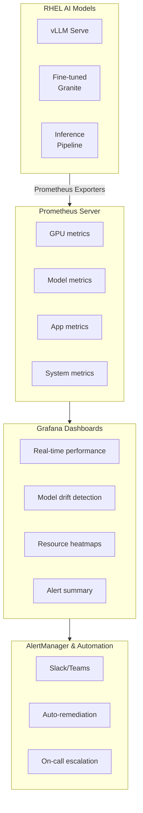

## Monitoring and Observability for RHEL AI Workloads

Deploying an AI model to production is only half the battle. The real challenge begins when your model starts making decisions at scale. Models drift, performance degrades silently, and users experience subtle degradation before metrics turn red.

This article covers building comprehensive monitoring for RHEL AI models using Prometheus and Grafana, ensuring you catch problems before they cost you.

### The AI Monitoring Challenge

Unlike traditional applications, AI systems face unique observability challenges:

- **Model Drift**: Model accuracy degrades as real-world data diverges from training data
- **Silent Failures**: A model returning plausible-but-wrong answers
- **Resource Utilization**: GPU memory, latency, and throughput vary with model load
- **Fairness Issues**: Systematic bias in predictions across demographic groups
- **Cold Start Problems**: Performance drops with new features or data distributions

Effective monitoring catches these issues at their source.

### Architecture Overview

Here's a production-ready monitoring stack for RHEL AI:



### Step 1: Install Prometheus and Grafana

On [RHEL 9](/blog/red-hat-enterprise-linux-9-for-sysadmins/):

```bash
# Install Prometheus
sudo dnf install -y prometheus

# Install Grafana
sudo dnf install -y grafana-server

# Start services
sudo systemctl start prometheus grafana-server
sudo systemctl enable prometheus grafana-server

# Verify
curl http://localhost:9090/api/v1/query?query=up
```

### Step 2: Configure Prometheus for RHEL AI

Edit the Prometheus configuration:

```yaml
# /etc/prometheus/prometheus.yml
global:
  scrape_interval: 15s
  evaluation_interval: 15s
  external_labels:
    cluster: 'rhel-ai-prod'
    environment: 'production'

scrape_configs:
  # GPU Metrics
  - job_name: 'nvidia-smi-metrics'
    static_configs:
      - targets: ['localhost:9400']

  # vLLM Inference Metrics
  - job_name: 'vllm-inference'
    static_configs:
      - targets: ['localhost:8000']
    metrics_path: '/metrics'

  # Model Drift Detector
  - job_name: 'model-drift-detector'
    static_configs:
      - targets: ['localhost:8001']
    scrape_interval: 60s

  # System Metrics
  - job_name: 'node-exporter'
    static_configs:
      - targets: ['localhost:9100']

  # Custom Application Metrics
  - job_name: 'rhel-ai-app'
    static_configs:
      - targets: ['localhost:9200']
```

Reload Prometheus:

```bash
sudo systemctl reload prometheus
```

### Step 3: Key Metrics to Monitor

#### GPU Metrics

Monitor GPU health and utilization:

```yaml
# GPU Memory Utilization
gpu_memory_used_bytes / gpu_memory_total_bytes

# GPU Temperature (alert if > 80°C)
gpu_temperature_celsius

# GPU Compute Utilization
gpu_utilization_percent
```

Create a Prometheus alert:

```yaml
# /etc/prometheus/rules/gpu_alerts.yml
groups:
  - name: gpu_alerts
    rules:
      - alert: GPUHighTemperature
        expr: gpu_temperature_celsius > 80
        for: 5m
        annotations:
          summary: "GPU temperature critical"
          
      - alert: GPUMemoryPressure
        expr: (gpu_memory_used_bytes / gpu_memory_total_bytes) > 0.9
        for: 2m
        annotations:
          summary: "GPU memory usage > 90%"
```

#### Model Inference Metrics

Track model performance in real-time:

```yaml
# P95 Latency (alert if > 100ms)
histogram_quantile(0.95, rate(vllm_request_duration_seconds_bucket[5m]))

# Throughput (requests/second)
rate(vllm_requests_total[5m])

# Model Accuracy on Recent Data
rate(model_correct_predictions_total[1h]) / rate(model_total_predictions_total[1h])

# Latency by Model
sum(rate(vllm_request_duration_seconds_sum[5m])) by (model) / 
  sum(rate(vllm_requests_total[5m])) by (model)
```

#### Model Drift Detection

Monitor whether predictions are degrading:

```yaml
# MMLU Score Drift (foundation benchmark)
mmlu_benchmark_score

# Prediction Confidence Trending Down
avg(prediction_confidence) < 0.75

# False Positive Rate Trending Up (for classification models)
rate(false_positives_total[1h]) / rate(total_predictions[1h])

# Latency Drift (slower inference = potential issues)
rate(inference_latency_p95_seconds[1h])
```

### Step 4: Build Grafana Dashboards

#### Dashboard 1: Real-Time Inference Performance

```json
{
  "dashboard": {
    "title": "RHEL AI Real-Time Inference",
    "panels": [
      {
        "title": "Requests Per Second",
        "targets": [{"expr": "rate(vllm_requests_total[5m])"}],
        "type": "graph"
      },
      {
        "title": "P50/P95/P99 Latency (ms)",
        "targets": [
          {"expr": "histogram_quantile(0.50, rate(vllm_request_duration_seconds_bucket[5m])) * 1000", "legendFormat": "P50"},
          {"expr": "histogram_quantile(0.95, rate(vllm_request_duration_seconds_bucket[5m])) * 1000", "legendFormat": "P95"},
          {"expr": "histogram_quantile(0.99, rate(vllm_request_duration_seconds_bucket[5m])) * 1000", "legendFormat": "P99"}
        ],
        "type": "graph",
        "thresholds": [
          {"value": 80, "color": "yellow", "label": "P95 Warning"},
          {"value": 150, "color": "red", "label": "P95 Critical"}
        ]
      },
      {
        "title": "GPU Utilization",
        "targets": [
          {"expr": "(gpu_memory_used_bytes / gpu_memory_total_bytes) * 100", "legendFormat": "Memory %"},
          {"expr": "gpu_utilization_percent", "legendFormat": "Compute %"}
        ],
        "type": "graph"
      },
      {
        "title": "Error Rate",
        "targets": [{"expr": "rate(vllm_request_errors_total[5m]) / rate(vllm_requests_total[5m])"}],
        "type": "stat",
        "thresholds": [0, 0.001, 0.01]
      }
    ]
  }
}
```

#### Dashboard 2: Model Drift Detection

```json
{
  "dashboard": {
    "title": "Model Drift Detection",
    "panels": [
      {
        "title": "Prediction Confidence Trend",
        "targets": [
          {"expr": "avg(prediction_confidence) by (model)"}
        ],
        "type": "graph",
        "alert": "If confidence drops > 5% in 24h"
      },
      {
        "title": "Latency Trend (Detection of Model Slowdown)",
        "targets": [
          {"expr": "rate(inference_latency_p95_seconds[5m])"}
        ],
        "type": "graph"
      },
      {
        "title": "Accuracy on Validation Set (Hourly)",
        "targets": [
          {"expr": "model_validation_accuracy"}
        ],
        "type": "graph",
        "thresholds": [
          {"value": 0.92, "color": "red", "label": "Below SLO"}
        ]
      },
      {
        "title": "Data Distribution Shift Detection",
        "targets": [
          {"expr": "kolmogorov_smirnov_test_p_value"}
        ],
        "type": "stat",
        "thresholds": [
          {"value": 0.05, "color": "red", "label": "Significant Drift"}
        ]
      }
    ]
  }
}
```

### Step 5: Set Up Automated Drift Detection

Create a Python service that monitors model drift:

```python
# /opt/rhel-ai/drift_detector.py
import os
from prometheus_client import start_http_server, Gauge
import numpy as np
from scipy.stats import entropy
import time

# Metrics
drift_score = Gauge('model_drift_score', 'KL divergence from training distribution')
accuracy_metric = Gauge('model_accuracy', 'Current model accuracy')
latency_p95 = Gauge('inference_latency_p95_seconds', 'P95 inference latency')

def detect_drift(recent_predictions, baseline_predictions):
    """Detect model drift using KL divergence"""
    recent_dist = np.histogram(recent_predictions, bins=50, range=(0, 1))[0]
    recent_dist = recent_dist / recent_dist.sum()
    
    baseline_dist = np.histogram(baseline_predictions, bins=50, range=(0, 1))[0]
    baseline_dist = baseline_dist / baseline_dist.sum()
    
    kl_divergence = entropy(recent_dist, baseline_dist)
    return kl_divergence

def calculate_accuracy(predictions, ground_truth):
    """Calculate accuracy on recent data"""
    return np.mean(predictions == ground_truth)

if __name__ == '__main__':
    start_http_server(8001)
    
    # Load baseline
    baseline_preds = np.load('/opt/rhel-ai/baseline_predictions.npy')
    
    while True:
        # Load recent predictions from model inference logs
        recent_preds = np.load('/tmp/recent_predictions.npy')
        ground_truth = np.load('/tmp/ground_truth.npy')
        
        # Calculate metrics
        drift = detect_drift(recent_preds, baseline_preds)
        accuracy = calculate_accuracy(recent_preds, ground_truth)
        
        # Update Prometheus metrics
        drift_score.set(drift)
        accuracy_metric.set(accuracy)
        
        # Alert if drift > threshold
        if drift > 0.5:
            print(f"⚠️  HIGH DRIFT DETECTED: {drift:.3f}")
        
        time.sleep(300)  # Check every 5 minutes
```

Run the drift detector:

```bash
# Create systemd service
sudo tee /etc/systemd/system/rhel-ai-drift-detector.service > /dev/null <<EOF
[Unit]
Description=RHEL AI Model Drift Detector
After=network.target

[Service]
Type=simple
User=rhel-ai
ExecStart=/usr/bin/python3 /opt/rhel-ai/drift_detector.py
Restart=always
StandardOutput=journal

[Install]
WantedBy=multi-user.target
EOF

sudo systemctl daemon-reload
sudo systemctl start rhel-ai-drift-detector
sudo systemctl enable rhel-ai-drift-detector
```

### Step 6: Set Up Alerting

Define alerts for production SLOs:

```yaml
# /etc/prometheus/rules/rhel-ai-slos.yml
groups:
  - name: rhel_ai_slos
    rules:
      # Inference Performance
      - alert: HighInferenceLatency
        expr: histogram_quantile(0.95, rate(vllm_request_duration_seconds_bucket[5m])) > 0.08
        for: 5m
        labels:
          severity: warning
        annotations:
          summary: "P95 latency {{ $value | humanizeDuration }}"

      # Model Accuracy
      - alert: ModelAccuracyDegraded
        expr: rate(model_correct_predictions_total[1h]) / rate(model_total_predictions_total[1h]) < 0.92
        for: 30m
        labels:
          severity: critical
        annotations:
          summary: "Model accuracy below SLO: {{ $value | humanizePercentage }}"

      # Drift Detection
      - alert: SignificantModelDrift
        expr: model_drift_score > 0.5
        for: 1h
        labels:
          severity: critical
        annotations:
          summary: "Model drift detected: {{ $value | humanize }}"

      # System Health
      - alert: GPUOutOfMemory
        expr: (gpu_memory_used_bytes / gpu_memory_total_bytes) > 0.95
        for: 2m
        labels:
          severity: critical
        annotations:
          summary: "GPU memory critical on {{ $labels.instance }}"
```

### Dashboard Views to Check Daily

1. **Morning Standup**: Check overnight accuracy, drift scores, and error rates
2. **During Peak Hours**: Monitor latency and throughput SLOs
3. **Weekly Review**: Analyze trends, identify slow degradation
4. **Monthly Analysis**: Calculate cost per inference, ROI on GPU investment

### Recommended SLOs (Chapter 6)

As defined in *Practical RHEL AI*, define SLOs that map to SLIs:

| Metric | Target | Warning | Critical |
|--------|--------|---------|----------|
| **P95 Latency** | **≤80ms** | 100ms | 150ms |
| Model Accuracy | ≥92% | 91% | 88% |
| Uptime | 99.9% | 99.5% | 99% |
| Error Rate | less than 0.1% | 0.5% | 1% |
| GPU Util | 60-80% | greater than 90% | greater than 95% |

**Key metrics from the book:**
- GPU thermals and cgroup pressure
- vLLM latency buckets
- **MMLU drift scores** for proactive alerts

### Next Steps

With comprehensive monitoring in place:

1. **Define alerting strategies** for your specific domain
2. **Build runbooks** for responding to common alerts
3. **Automate remediation** (scale GPU, trigger retraining, rollback)
4. **Track business metrics** alongside technical metrics

### Resources

- [Prometheus Documentation](https://prometheus.io/docs/)
- [Grafana Dashboard Templates](https://grafana.com/grafana/dashboards/)
- [Model Monitoring Best Practices](https://github.com/eugeneyan/monitoring-machine-learning)
- [vLLM Metrics Guide](https://docs.vllm.ai/en/latest/serving/metrics.html)

---

**The next article will explore AI governance, security, and compliance—ensuring your RHEL AI deployment meets enterprise standards.**

---

## Build Production-Grade Observability

**Want complete monitoring coverage for your AI infrastructure?**

*Practical RHEL AI* includes comprehensive observability guidance:

- ✅ Ready-to-import Grafana dashboards
- ✅ Prometheus alerting rules for GPU thermals and cgroup pressure
- ✅ MMLU drift detection scripts
- ✅ vLLM latency bucket configuration
- ✅ SLO/SLI templates for AI workloads

<div style="background: linear-gradient(135deg, #ee0000 0%, #cc0000 100%); padding: 2rem; border-radius: 12px; text-align: center; margin: 2rem 0;">
  <h3 style="color: white; margin-bottom: 1rem;">📊 Achieve P95 ≤ 80ms Latency</h3>
  <p style="color: white; margin-bottom: 1.5rem;"><strong>Practical RHEL AI</strong> gives you the monitoring tools to meet enterprise SLOs and detect issues before they impact users.</p>
  <a href="/books/" style="display: inline-block; background: white; color: #cc0000; padding: 0.75rem 2rem; border-radius: 8px; font-weight: bold; text-decoration: none; margin-right: 1rem;">Learn More →</a>
  <a href="https://amzn.to/4qjORdC" style="display: inline-block; background: #ff9900; color: #111; padding: 0.75rem 2rem; border-radius: 8px; font-weight: bold; text-decoration: none;">Buy on Amazon →</a>
</div>

## Related Articles

- [Architecture to Scale AI in the Enterprise](/blog/architecture-scale-ai-enterprise-platform/)
- [GPU Sharing on Kubernetes Guide](/blog/gpu-sharing-kubernetes-mig-mps/)
- [Packed Room at KubeCon Europe 2026: Multi-Tenant GPUs on Bare Metal](/blog/kubecon-2026-talk-multi-tenant-gpus-recap/)
