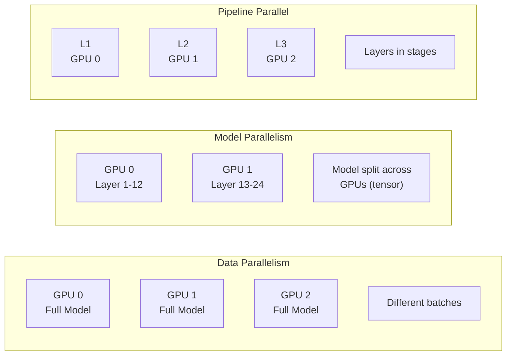
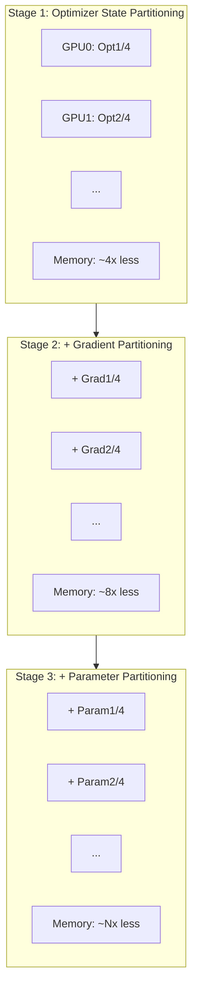

Training large language models often requires more compute power than a single GPU can provide. RHEL AI supports sophisticated **multi-GPU training strategies** that let you scale from a single workstation to a multi-node cluster. This guide covers the parallelism techniques, configuration patterns, and optimization strategies you need to master distributed training.

## Understanding Parallelism Strategies

Different parallelism approaches solve different scaling challenges. Choose the right strategy based on your model size and hardware.

### Parallelism Overview



### When to Use Each Strategy

| Strategy | Best For | Memory Efficiency | Communication |
|----------|----------|-------------------|---------------|
| **Data Parallel** | Small-medium models | Low | Gradient sync |
| **Model Parallel** | Large models | High | Activation transfer |
| **Pipeline** | Very deep models | Medium | Stage boundaries |
| **ZeRO** | Any size | Very High | Partitioned states |

## Data Parallelism with PyTorch DDP

Data parallelism replicates the model across GPUs, with each processing different data batches.

### Basic DDP Setup

```python
#!/usr/bin/env python3
"""ddp_training.py - Distributed Data Parallel training"""

import torch
import torch.distributed as dist
from torch.nn.parallel import DistributedDataParallel as DDP
from torch.utils.data.distributed import DistributedSampler

def setup_ddp(rank: int, world_size: int):
    """Initialize DDP process group."""
    dist.init_process_group(
        backend="nccl",  # NVIDIA Collective Communications Library
        init_method="env://",
        rank=rank,
        world_size=world_size
    )
    torch.cuda.set_device(rank)

def cleanup_ddp():
    """Clean up DDP resources."""
    dist.destroy_process_group()

def train_ddp(rank: int, world_size: int, model, dataset, epochs: int):
    """Train with Distributed Data Parallel."""
    setup_ddp(rank, world_size)
    
    # Move model to GPU and wrap with DDP
    model = model.to(rank)
    ddp_model = DDP(model, device_ids=[rank])
    
    # Create distributed sampler
    sampler = DistributedSampler(
        dataset,
        num_replicas=world_size,
        rank=rank,
        shuffle=True
    )
    
    dataloader = torch.utils.data.DataLoader(
        dataset,
        batch_size=32,
        sampler=sampler,
        num_workers=4,
        pin_memory=True
    )
    
    optimizer = torch.optim.AdamW(ddp_model.parameters(), lr=1e-4)
    
    for epoch in range(epochs):
        sampler.set_epoch(epoch)  # Important for shuffling
        
        for batch in dataloader:
            optimizer.zero_grad()
            
            inputs = batch["input_ids"].to(rank)
            labels = batch["labels"].to(rank)
            
            outputs = ddp_model(inputs, labels=labels)
            loss = outputs.loss
            
            loss.backward()
            optimizer.step()
        
        if rank == 0:
            print(f"Epoch {epoch}: Loss = {loss.item():.4f}")
    
    cleanup_ddp()

# Launch with torchrun
# torchrun --nproc_per_node=4 ddp_training.py
```

### Launching DDP Training

```bash
# Single node, 4 GPUs
torchrun --nproc_per_node=4 ddp_training.py

# Multi-node setup (node 0)
torchrun \
  --nnodes=2 \
  --nproc_per_node=4 \
  --node_rank=0 \
  --master_addr=node0.cluster \
  --master_port=29500 \
  ddp_training.py

# Multi-node setup (node 1)
torchrun \
  --nnodes=2 \
  --nproc_per_node=4 \
  --node_rank=1 \
  --master_addr=node0.cluster \
  --master_port=29500 \
  ddp_training.py
```

## DeepSpeed ZeRO for Memory Efficiency

DeepSpeed's ZeRO (Zero Redundancy Optimizer) partitions model states across GPUs for massive memory savings.

### ZeRO Stages Explained



### DeepSpeed Configuration

```json
{
  "train_batch_size": 128,
  "gradient_accumulation_steps": 4,
  "fp16": {
    "enabled": true,
    "loss_scale": 0,
    "initial_scale_power": 16
  },
  "zero_optimization": {
    "stage": 3,
    "offload_optimizer": {
      "device": "cpu",
      "pin_memory": true
    },
    "offload_param": {
      "device": "cpu",
      "pin_memory": true
    },
    "overlap_comm": true,
    "contiguous_gradients": true,
    "reduce_bucket_size": 5e8,
    "stage3_prefetch_bucket_size": 5e8,
    "stage3_param_persistence_threshold": 1e6
  },
  "optimizer": {
    "type": "AdamW",
    "params": {
      "lr": 1e-4,
      "betas": [0.9, 0.999],
      "eps": 1e-8,
      "weight_decay": 0.01
    }
  },
  "scheduler": {
    "type": "WarmupDecayLR",
    "params": {
      "warmup_min_lr": 0,
      "warmup_max_lr": 1e-4,
      "warmup_num_steps": 1000,
      "total_num_steps": 50000
    }
  }
}
```

### Running with DeepSpeed

```bash
# Single node with DeepSpeed
deepspeed --num_gpus=4 train.py \
  --deepspeed ds_config.json

# Multi-node with hostfile
cat > hostfile << EOF
node0 slots=4
node1 slots=4
EOF

deepspeed --hostfile=hostfile train.py \
  --deepspeed ds_config.json
```

## InstructLab Multi-GPU Configuration

InstructLab integrates seamlessly with multi-GPU setups through its configuration system.

### InstructLab Training Config

```yaml
# ~/.config/instructlab/config.yaml
train:
  # Multi-GPU settings
  distributed: true
  num_gpus: 4
  
  # DeepSpeed integration
  deepspeed:
    enabled: true
    config_path: ~/.config/instructlab/ds_config.json
    zero_stage: 3
  
  # Training parameters
  batch_size: 8
  gradient_accumulation_steps: 4
  effective_batch_size: 128  # 8 * 4 * 4 GPUs
  
  # Memory optimization
  gradient_checkpointing: true
  mixed_precision: bf16
  
  # Model settings
  model:
    base: granite-7b-base
    max_seq_length: 4096
```

### Running InstructLab Training

```bash
# Single node multi-GPU
ilab model train \
  --distributed \
  --num-gpus 4 \
  --deepspeed-config ds_config.json

# With specific GPU selection
CUDA_VISIBLE_DEVICES=0,1,2,3 ilab model train \
  --distributed \
  --num-gpus 4

# Multi-node training
ilab model train \
  --distributed \
  --nnodes 2 \
  --node-rank 0 \
  --master-addr 192.168.1.100 \
  --master-port 29500
```

## NCCL Optimization for Multi-GPU

NVIDIA Collective Communications Library (NCCL) handles GPU-to-GPU communication. Optimize it for best performance.

### NCCL Environment Variables

```bash
# Enable optimal algorithms
export NCCL_ALGO=Ring
export NCCL_PROTO=Simple

# Network interface selection (for multi-node)
export NCCL_SOCKET_IFNAME=eth0
export NCCL_IB_DISABLE=0  # Enable InfiniBand if available

# Debugging (disable in production)
export NCCL_DEBUG=WARN
export NCCL_DEBUG_SUBSYS=ALL

# Performance tuning
export NCCL_BUFFSIZE=2097152
export NCCL_NTHREADS=512
```

### Verifying NCCL Performance

```python
#!/usr/bin/env python3
"""nccl_benchmark.py - Test NCCL all-reduce performance"""

import torch
import torch.distributed as dist
import time

def benchmark_allreduce(size_mb: int, iterations: int = 100):
    """Benchmark all-reduce performance."""
    rank = dist.get_rank()
    world_size = dist.get_world_size()
    
    # Create tensor
    tensor_size = size_mb * 1024 * 1024 // 4  # float32
    tensor = torch.randn(tensor_size, device=f"cuda:{rank}")
    
    # Warmup
    for _ in range(10):
        dist.all_reduce(tensor)
    
    torch.cuda.synchronize()
    
    # Benchmark
    start = time.perf_counter()
    for _ in range(iterations):
        dist.all_reduce(tensor)
    torch.cuda.synchronize()
    elapsed = time.perf_counter() - start
    
    # Calculate bandwidth
    data_transferred = size_mb * 2 * (world_size - 1) / world_size
    bandwidth = data_transferred * iterations / elapsed
    
    if rank == 0:
        print(f"Size: {size_mb}MB, Bandwidth: {bandwidth:.2f} MB/s")

# Run with: torchrun --nproc_per_node=4 nccl_benchmark.py
```

## Gradient Checkpointing for Large Models

When GPU memory is tight, gradient checkpointing trades compute for memory.

### Enabling Gradient Checkpointing

```python
from transformers import AutoModelForCausalLM
import torch.utils.checkpoint as checkpoint

# Method 1: Transformers built-in
model = AutoModelForCausalLM.from_pretrained(
    "ibm-granite/granite-7b-base",
    gradient_checkpointing=True
)

# Method 2: Manual checkpointing
class CheckpointedBlock(torch.nn.Module):
    def __init__(self, block):
        super().__init__()
        self.block = block
    
    def forward(self, x):
        return checkpoint.checkpoint(
            self.block,
            x,
            use_reentrant=False
        )
```

### Memory Savings with Checkpointing

| Model Size | Without Checkpointing | With Checkpointing | Savings |
|------------|----------------------|-------------------|---------|
| 7B params | ~56 GB | ~28 GB | 50% |
| 13B params | ~104 GB | ~52 GB | 50% |
| 34B params | ~272 GB | ~136 GB | 50% |

## Monitoring Distributed Training

Track GPU utilization, memory, and communication across all nodes.

### Real-time Monitoring Script

```python
#!/usr/bin/env python3
"""distributed_monitor.py - Monitor multi-GPU training"""

import torch
import torch.distributed as dist
import threading
import time
from collections import deque

class DistributedMonitor:
    def __init__(self, log_interval: int = 10):
        self.rank = dist.get_rank()
        self.world_size = dist.get_world_size()
        self.log_interval = log_interval
        self.metrics = deque(maxlen=100)
        self._running = False
    
    def _collect_metrics(self):
        """Collect GPU metrics."""
        return {
            "rank": self.rank,
            "memory_allocated": torch.cuda.memory_allocated() / 1e9,
            "memory_reserved": torch.cuda.memory_reserved() / 1e9,
            "utilization": torch.cuda.utilization(),
            "timestamp": time.time()
        }
    
    def _monitor_loop(self):
        """Background monitoring loop."""
        while self._running:
            metrics = self._collect_metrics()
            self.metrics.append(metrics)
            
            # Aggregate across ranks
            if self.rank == 0:
                all_metrics = [None] * self.world_size
                dist.gather_object(metrics, all_metrics, dst=0)
                self._log_metrics(all_metrics)
            else:
                dist.gather_object(metrics, dst=0)
            
            time.sleep(self.log_interval)
    
    def _log_metrics(self, all_metrics):
        """Log aggregated metrics."""
        print("\n" + "="*60)
        print("Distributed Training Monitor")
        print("="*60)
        for m in all_metrics:
            print(f"GPU {m['rank']}: "
                  f"Mem: {m['memory_allocated']:.1f}/{m['memory_reserved']:.1f} GB, "
                  f"Util: {m['utilization']}%")
    
    def start(self):
        self._running = True
        self._thread = threading.Thread(target=self._monitor_loop)
        self._thread.start()
    
    def stop(self):
        self._running = False
        self._thread.join()
```

### Prometheus Metrics for Distributed Training

```yaml
# prometheus-distributed.yml
global:
  scrape_interval: 5s

scrape_configs:
  - job_name: 'distributed-training'
    static_configs:
      - targets:
          - 'node0:9400'
          - 'node1:9400'
          - 'node2:9400'
          - 'node3:9400'
    relabel_configs:
      - source_labels: [__address__]
        target_label: node
        regex: '(.+):\d+'
        replacement: '${1}'
```

## Troubleshooting Multi-GPU Issues

Common problems and solutions for distributed training.

### Communication Timeouts

```bash
# Symptom: NCCL timeout errors

# Solution 1: Increase timeout
export NCCL_TIMEOUT=1800  # 30 minutes

# Solution 2: Check network connectivity
ping node1.cluster
ib_write_bw -d mlx5_0  # InfiniBand test

# Solution 3: Verify GPU visibility
nvidia-smi topo -m  # Check GPU topology
```

### Memory Imbalance

```python
# Symptom: One GPU runs out of memory before others

# Solution: Balance batch distribution
sampler = DistributedSampler(
    dataset,
    num_replicas=world_size,
    rank=rank,
    shuffle=True,
    drop_last=True  # Ensure equal batch sizes
)
```

### Slow Training Speed

```bash
# Check for bottlenecks
# 1. GPU utilization should be >90%
nvidia-smi dmon -s u

# 2. Check NCCL bandwidth
nccl-tests/build/all_reduce_perf -b 8 -e 128M

# 3. Profile with torch.profiler
python -m torch.profiler.profile train.py
```

## Related Book Content

This article covers material from:
- **Chapter 4: Advanced Features** - DeepSpeed ZeRO, MiCS configuration
- **Chapter 2: Installation** - Multi-GPU setup and CUDA configuration
- **Chapter 3: Core Components** - Training pipeline architecture

---

## Scale Your Training Infrastructure

**Ready to train on multiple GPUs?**

*Practical RHEL AI* provides complete distributed training guidance:

- ✅ Step-by-step multi-GPU configuration
- ✅ DeepSpeed ZeRO optimization recipes
- ✅ NCCL tuning for maximum throughput
- ✅ Multi-node cluster deployment
- ✅ Production monitoring dashboards

<div style="background: linear-gradient(135deg, #ee0000 0%, #cc0000 100%); padding: 2rem; border-radius: 12px; text-align: center; margin: 2rem 0;">
  <h3 style="color: white; margin-bottom: 1rem;">⚡ Scale to Any Size</h3>
  <p style="color: white; margin-bottom: 1.5rem;"><strong>Practical RHEL AI</strong> shows you how to train models of any size with efficient multi-GPU strategies.</p>
  <a href="/books/" style="display: inline-block; background: white; color: #cc0000; padding: 0.75rem 2rem; border-radius: 8px; font-weight: bold; text-decoration: none; margin-right: 1rem;">Learn More →</a>
  <a href="https://amzn.to/4qjORdC" style="display: inline-block; background: #ff9900; color: #111; padding: 0.75rem 2rem; border-radius: 8px; font-weight: bold; text-decoration: none;">Buy on Amazon →</a>
</div>
