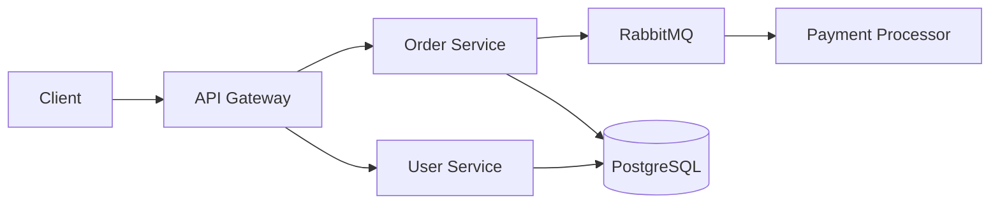

## The Documentation Decay Problem

I recently asked an engineering team when their main README was last accurate. The tech lead laughed and said: "Probably the day it was written."

This is not an isolated case. In my 18 years of consulting, I have never encountered a team whose external documentation (Notion, Confluence, Google Docs, SharePoint) accurately reflected the current state of their system for more than a few weeks.

The reason is simple: **documentation that lives outside the code changes at a different velocity than the code itself.** Your codebase changes 20–50 times per week. Your Notion page changes when someone remembers it exists — which is roughly never.

The cost is real. Every outdated doc is a future interruption. A new developer follows a stale README, hits an error, and pulls a senior engineer out of flow state. That interruption costs [23 minutes of recovery time](https://ics.uci.edu/~gmark/chi2008-mark.pdf) for the senior engineer, plus the frustration and lost confidence for the new hire.

Across a team of 15 engineers doing 3–4 hires per year, stale documentation easily costs **200–400 hours annually** in misdirection and interruption.

## Why Traditional Approaches Fail

### The "Everyone Should Update Docs" Approach

This is the most common strategy, and it fails 100% of the time. Here is why:

- **No feedback loop** — nobody knows the docs are wrong until someone follows them and fails
- **No ownership** — "everyone" means "nobody"
- **Wrong incentives** — shipping features is visible and rewarded; updating docs is invisible and thankless
- **Workflow mismatch** — code is in Git, docs are in Notion. Context-switching kills compliance.

### The "Documentation Sprint" Approach

Some teams schedule quarterly "doc days" where everyone updates documentation. This produces a burst of accurate docs that begin decaying immediately. By the next quarter, you are back to square one.

### The "Hire a Technical Writer" Approach

Technical writers produce beautiful documentation. But unless they are embedded in the engineering team and review every pull request, their docs suffer the same decay problem — just with better formatting.

## Docs-as-Code: The Only Pattern That Works

The solution is to treat documentation exactly like code:

- **Stored in the same repository** as the code it describes
- **Reviewed in pull requests** alongside code changes
- **Validated by CI pipelines** on every commit
- **Versioned** with the code, so docs and code are always in sync

This is not a new idea, but most teams implement it halfway. They put a `docs/` folder in the repo and call it done. That is not docs-as-code — that is just docs in a different folder.

Real docs-as-code means **automated validation that fails the build when docs drift from reality.**

## Building Self-Healing Documentation

Here is the practical playbook I use with clients. Each layer adds automated protection against documentation decay.

### Layer 1: README Validation in CI

The simplest starting point — verify that documented commands actually work.

```yaml
# .gitlab-ci.yml
doc-validation:
  stage: test
  script:
    # Verify documented setup commands work
    - grep -A5 "## Quick Start" README.md | grep '^\$' | sed 's/^\$ //' | while read cmd; do
        echo "Testing: $cmd"
        eval "$cmd" || { echo "README command failed: $cmd"; exit 1; }
      done
    # Verify documented env vars exist in .env.example
    - grep -oP 'export \K[A-Z_]+' README.md | while read var; do
        grep -q "$var" .env.example || { echo "Missing from .env.example: $var"; exit 1; }
      done
  only:
    changes:
      - README.md
      - .env.example
      - docker-compose*.yml
```

If someone changes the docker-compose file but forgets to update the README, the pipeline catches it.

### Layer 2: API Documentation from Code

Never manually document API endpoints. Generate them from code annotations.

```typescript
// src/routes/users.ts
/**
 * @openapi
 * /api/users:
 *   get:
 *     summary: List all users
 *     parameters:
 *       - name: limit
 *         in: query
 *         schema:
 *           type: integer
 *           default: 20
 *     responses:
 *       200:
 *         description: List of users
 */
router.get('/api/users', async (req, res) => {
  // implementation
});
```

The OpenAPI spec is generated from these annotations during the build. If the code changes but the annotation does not, the generated spec and the actual behavior diverge — which integration tests will catch.

### Layer 3: Architecture Diagrams from Code

Static architecture diagrams in draw.io or Lucidchart are outdated the moment someone adds a new service. Use diagrams-as-code instead.



Store this in `docs/architecture.md`. When a developer adds a new service, they update the diagram in the same pull request — because it is in the same repo, reviewed by the same people.

For more sophisticated setups, tools like [Structurizr](https://structurizr.com/) generate architecture diagrams from a DSL that can be validated against your actual infrastructure using [Terraform](https://www.terraformpilot.com/) or Kubernetes manifests.

### Layer 4: Runbook Validation

Runbooks (incident response procedures) are the most dangerous documents to let go stale. If your "how to restart the payment service" runbook is wrong during a 3 AM outage, you are in trouble.

```yaml
# Ansible playbook that validates runbook steps
# Run weekly via CI scheduled pipeline
- name: Validate runbook procedures
  hosts: staging
  tasks:
    - name: "Runbook step 1: Check service health endpoint"
      ansible.builtin.uri:
        url: "http://{{ service_host }}:{{ service_port }}/health"
        status_code: 200
      register: health_check

    - name: "Runbook step 2: Verify log location exists"
      ansible.builtin.stat:
        path: "/var/log/{{ service_name }}/application.log"
      register: log_file
      failed_when: not log_file.stat.exists
```

If any runbook step fails validation against the staging environment, the team gets notified before it matters in production. This is exactly the kind of automation that [Ansible](https://www.ansiblepilot.com/) excels at — turning manual procedures into testable, repeatable code.

### Layer 5: Onboarding Path as Integration Test

The ultimate test of documentation quality: does a fresh environment work by following the docs?

```yaml
# .github/workflows/onboarding-test.yml
name: Onboarding Smoke Test
on:
  schedule:
    - cron: '0 6 * * 1'  # Every Monday at 6 AM
  push:
    paths:
      - 'README.md'
      - 'ONBOARDING.md'
      - 'docker-compose*.yml'
      - '.env.example'

jobs:
  fresh-setup:
    runs-on: ubuntu-latest
    steps:
      - uses: actions/checkout@v4
      
      - name: Simulate fresh developer setup
        run: |
          # Follow README setup instructions exactly
          cp .env.example .env
          docker compose up -d
          sleep 30
          
          # Verify app is running
          curl -f http://localhost:3000/health || exit 1
          
          # Run the test suite
          docker compose exec -T app npm test || exit 1
          
          # Verify seed data loaded
          docker compose exec -T db psql -U dev -d app \
            -c "SELECT count(*) FROM users" | grep -q '[1-9]' || exit 1
          
      - name: Notify on failure
        if: failure()
        run: |
          echo "::warning::Onboarding documentation is broken!"
          echo "A fresh setup following README.md failed."
          echo "Please update the documentation."
```

This runs every Monday. If the onboarding path breaks, the team knows before the next new hire discovers it the hard way.

## The Documentation Stack I Recommend

After implementing this pattern across multiple organizations, here is the stack that works:

| Layer | Tool | What It Validates |
|---|---|---|
| README/Setup | CI script | Documented commands actually work |
| API docs | OpenAPI + Swagger | Endpoints match code annotations |
| Architecture | Mermaid/Structurizr | Diagrams live in repo, reviewed in PRs |
| ADRs | Markdown in `docs/adr/` | Decision context preserved with code |
| Runbooks | Ansible playbooks | Procedures tested against staging weekly |
| Onboarding | CI integration test | Fresh setup works end-to-end |
| Conventions | Linters + pre-commit | Rules enforced automatically |

## What Changes Culturally

When documentation is validated by CI, something interesting happens: **documentation becomes a first-class engineering artifact.**

Pull request reviews start including questions like "did you update the architecture diagram?" — not because of a process mandate, but because the pipeline will fail if the diagram does not reflect the new service.

New developers trust the docs because they know the docs are tested. Senior engineers spend less time answering questions because the answers are accurate and findable.

The result I typically see:

- **Onboarding time drops 40–60%** — from 6–10 weeks to 2–4 weeks
- **Senior engineer interruptions drop 50%+** — docs answer the question before it is asked
- **Documentation maintenance becomes incremental** — small updates in every PR instead of massive quarterly efforts
- **New hire confidence increases** — they trust the environment because it works as documented

## Start Monday

You do not need to implement all five layers at once. Start with one:

1. **Add a CI step that runs your README setup commands** in a clean container. If it fails, the README is wrong.

That single change creates the feedback loop that makes everything else possible. Once the team sees a pipeline fail because of stale docs, the culture shifts.

Documentation is not a writing problem. It is an engineering problem. Solve it with engineering tools.
