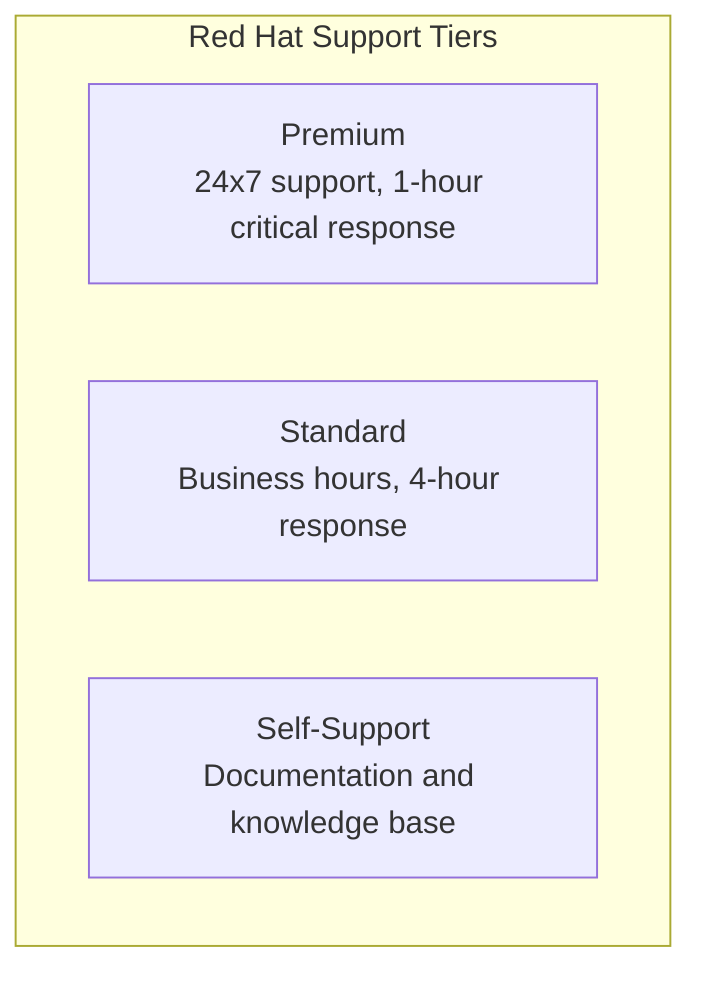
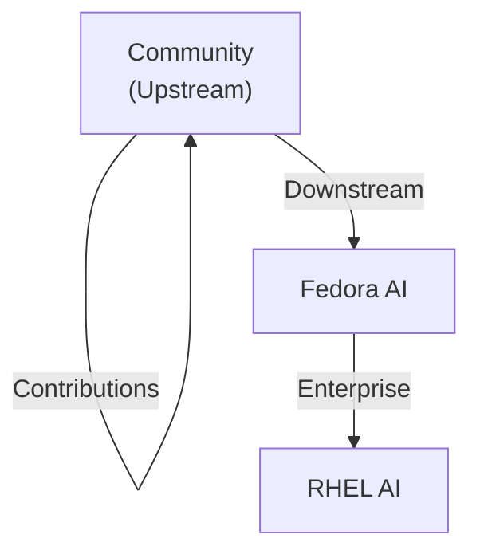

> **📘 Book Reference:** This article is based on **Chapter 9: Community and Support** of [Practical RHEL AI](/books/), providing a comprehensive guide to navigating the RHEL AI ecosystem.

## Introduction

Success with RHEL AI extends beyond technical implementation. Chapter 9 of *Practical RHEL AI* covers the vibrant ecosystem surrounding the platform, from official Red Hat support to community-driven innovation through InstructLab.

## Official Red Hat Resources

### Documentation Portal

The primary source for RHEL AI documentation:

| Resource | URL | Content |
|----------|-----|---------|
| Product Docs | access.redhat.com/documentation | Official guides |
| Knowledge Base | access.redhat.com/solutions | Troubleshooting |
| Release Notes | access.redhat.com/errata | Updates |
| API Reference | access.redhat.com/api | SDK docs |

### Support Channels

Enterprise support options for RHEL AI:



### Opening Support Cases

```bash
# Using Red Hat Support Tool
redhat-support-tool addcase \
  --product "Red Hat Enterprise Linux AI" \
  --version "1.0" \
  --summary "Issue with InstructLab training" \
  --description "Training fails at synthetic data generation step"
```

## InstructLab Community

### What is InstructLab?

InstructLab is the open-source project underlying RHEL AI's model fine-tuning capabilities. Contributing to InstructLab benefits the entire community.

### Getting Started with Contributions

```bash
# Clone the InstructLab repository
git clone https://github.com/instructlab/instructlab.git
cd instructlab

# Set up development environment
python -m venv venv
source venv/bin/activate
pip install -e ".[dev]"

# Run tests
pytest tests/
```

### Taxonomy Contributions

The taxonomy repository powers InstructLab's skill definitions:

```yaml
# Example contribution: taxonomy/knowledge/technology/cloud/qna.yaml
created_by: your-github-username
version: 1
seed_examples:
  - context: |
      Information about cloud-native AI deployment patterns
    question: "What are best practices for deploying AI on Kubernetes?"
    answer: |
      Best practices include:
      1. Use GPU node pools with appropriate taints
      2. Implement resource quotas for training jobs
      3. Use persistent volumes for model artifacts
      4. Configure horizontal pod autoscaling for inference
```

### Contribution Workflow

```
1. Fork Repository
       │
       ▼
2. Create Branch (feature/your-feature)
       │
       ▼
3. Add/Modify Taxonomy Files
       │
       ▼
4. Run Local Validation
       │
       ▼
5. Submit Pull Request
       │
       ▼
6. Community Review
       │
       ▼
7. Merge & Celebrate 🎉
```

## Community Forums and Discussion

### Official Channels

| Platform | Purpose | URL |
|----------|---------|-----|
| GitHub Discussions | Technical Q&A | github.com/instructlab |
| Red Hat Community | General discussion | community.redhat.com |
| Discord | Real-time chat | InstructLab Discord |
| Mailing Lists | Announcements | lists.fedoraproject.org |

### Best Practices for Getting Help

```markdown
## Good Question Template

**Environment:**
- RHEL Version: 9.3
- RHEL AI Version: 1.0
- GPU: NVIDIA A100 80GB
- Python: 3.11

**What I'm trying to do:**
Fine-tune Granite 3B on custom taxonomy

**What I've tried:**
1. Followed documentation at [link]
2. Ran `ilab generate` with config...

**Error message:**
```
[paste relevant error]
```

**Expected behavior:**
Synthetic data generation should complete
```

## Training and Certification

### Learning Paths

Red Hat offers structured learning for RHEL AI:

1. **DO007** - Ansible Basics for AI Automation
2. **AI100** - Introduction to RHEL AI
3. **AI200** - Advanced InstructLab Techniques
4. **AI300** - Production AI Deployment

### Self-Paced Resources

```yaml
learning_resources:
  - name: "RHEL AI Quick Start"
    type: "Tutorial"
    duration: "2 hours"
    url: "developers.redhat.com/rhel-ai-quickstart"
  
  - name: "InstructLab Workshop"
    type: "Hands-on Lab"
    duration: "4 hours"
    url: "github.com/instructlab/workshops"
  
  - name: "Practical RHEL AI Book"
    type: "Comprehensive Guide"
    duration: "Self-paced"
    url: "lucaberton.com/books"
```

## Open Source Ecosystem

### Related Projects

RHEL AI builds on several open-source foundations:

| Project | Role | Repository |
|---------|------|------------|
| InstructLab | Fine-tuning | github.com/instructlab |
| vLLM | Inference | github.com/vllm-project/vllm |
| DeepSpeed | Training | github.com/microsoft/DeepSpeed |
| Podman | Containers | github.com/containers/podman |
| Prometheus | Monitoring | github.com/prometheus |

### Upstream First Philosophy

Red Hat's approach ensures community contributions flow upstream:



## Enterprise Integration

### Partner Ecosystem

RHEL AI integrates with leading enterprise platforms:

```yaml
integrations:
  cloud_providers:
    - AWS (EC2 P4d, P5)
    - Azure (NC/ND Series)
    - GCP (A2/A3 Instances)
    - IBM Cloud
  
  orchestration:
    - OpenShift AI
    - Kubernetes
    - Ansible Automation Platform
  
  observability:
    - Datadog
    - Grafana Cloud
    - Splunk
```

### ISV Certifications

Hardware and software certifications for RHEL AI:

| Vendor | Product | Certification |
|--------|---------|---------------|
| NVIDIA | A100, H100 | Certified |
| AMD | MI300X | Certified |
| Intel | Gaudi2 | In Progress |
| Dell | PowerEdge | Certified |
| HPE | ProLiant | Certified |

## Contributing Back

### Ways to Contribute

1. **Code Contributions** - Fix bugs, add features
2. **Documentation** - Improve guides and tutorials
3. **Taxonomy** - Add domain-specific skills
4. **Testing** - Report bugs, validate fixes
5. **Community Support** - Help others in forums

### Recognition Programs

Active contributors may be recognized through:
- GitHub contributor badges
- Community spotlight features
- Red Hat Summit speaker opportunities
- Early access to new features

## Getting Started Checklist

```markdown
□ Register at access.redhat.com
□ Join InstructLab Discord
□ Fork InstructLab repository
□ Complete AI100 training module
□ Run your first fine-tuning job
□ Submit first taxonomy contribution
□ Read Practical RHEL AI book
```

## Related Book Content

This article covers material from:
- **Chapter 9: Community and Support** - All resources and channels
- **Chapter 1: Introduction** - RHEL AI ecosystem overview
- **Chapter 5: Custom Applications** - Practical contribution examples

---

## Join the RHEL AI Community

**Ready to accelerate your RHEL AI journey?**

*Practical RHEL AI* is your complete guide:

- ✅ Step-by-step tutorials for all skill levels
- ✅ Production-ready code examples
- ✅ Troubleshooting guides for common issues
- ✅ Best practices from Red Hat experts
- ✅ Community contribution guidelines

<div style="background: linear-gradient(135deg, #ee0000 0%, #cc0000 100%); padding: 2rem; border-radius: 12px; text-align: center; margin: 2rem 0;">
  <h3 style="color: white; margin-bottom: 1rem;">🤝 Your Guide to Enterprise AI Success</h3>
  <p style="color: white; margin-bottom: 1.5rem;"><strong>Practical RHEL AI</strong> combines community wisdom with enterprise-grade guidance in one comprehensive resource.</p>
  <a href="/books/" style="display: inline-block; background: white; color: #cc0000; padding: 0.75rem 2rem; border-radius: 8px; font-weight: bold; text-decoration: none; margin-right: 1rem;">Learn More →</a>
  <a href="https://amzn.to/4qjORdC" style="display: inline-block; background: #ff9900; color: #111; padding: 0.75rem 2rem; border-radius: 8px; font-weight: bold; text-decoration: none;">Buy on Amazon →</a>
</div>
